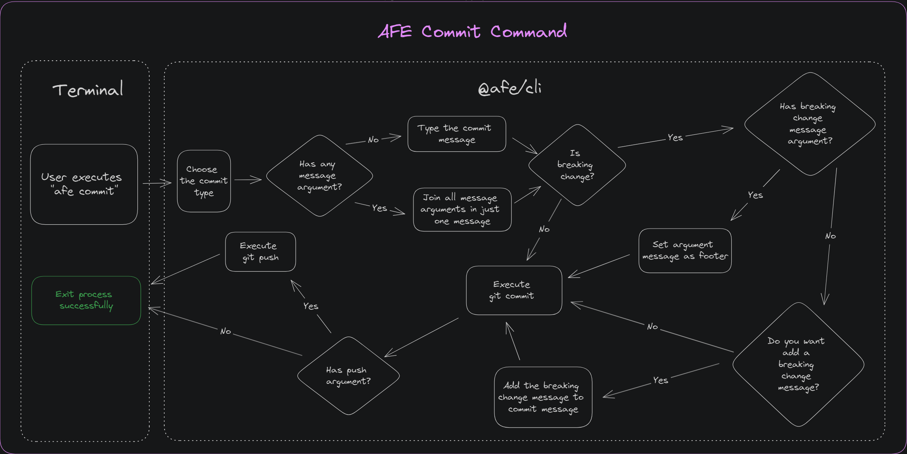

# Command for standardization of commits

In order to facilitate the use of the ['afe version'](./version/index.md) command, the 'afe commit' command assists in creating a visual interface to execute the 'git commit' command with the proper nomenclature for the **release** process.

You can check it in the [afe version](./version/index.md) command documentation.

## Prerequisites

- Installing [***@afe/cli***](./index.md)
- Have in your ***scripts*** of ***package.json*** the ***version*** script

```json
{
    "scripts": {
        "version": "afe version"
    }
}
```

## Usage

### Adding the files in ***stage***

Before running the command, it must be made sure that the changes that will be part of the commit must be in the stage:

``` BASH

# All the files
git add .

# Specific files
git add ./folder-name-or-file
```

### Command execution

When executing the command, with the configs showed above:

``` BASH
afe version

# or in case of configuring the script in package.json

npm run version
```

It's possible to pass the following parameters to the command:

#### Parameter

Parameter | Description
----------- | ------------
'-m "<*message*>"' | ***commit message(s***), can be multiple like the 'git commit' command
'--breakingChangeMessage "<*message*>"' | If you have been selected to run a ***BREAKING CHANGE***, this will be the message used as a descriptive in ***CHANGELOG.md***
'--no-push' | When the process is finished, it does not perform the push to the repository's ***remote***

> Remembering that if you are using npm script ('npm run commit'), you need to add a ***--*** separator between the command and the parameters. E.g. 'npm run commit -- -m "message" --no-push'

___

When you run the command, the following question will appear:

``` BASH
? What kind of commit do you want to make? › - Use arrow-keys. Return to submit.
❯ feat: A new feature
  fix: A bug fix
  deprecated: Deprecation of a class or method
  BREAKING CHANGE: A change that caused a breaking change
```

Using the ↑ and ↓ arrows choose the option that best suits the ***commit*** scenario to be performed. To select press ***Enter***

If you have not passed any message through the '-m' parameter, the following question will appear:

``` BASH
? What is the message of your commit? ›
```

With the message typed, press ***Enter***

If you have selected the commit type as ***BREAKING CHANGE***, and have not passed any messages through the `--breakingChangeMessage` parameter, the following optional question will appear:

``` BASH
? Do you want to include a friendly message for your Breaking Change? ›
```

With the message typed, press ***Enter***.

If you don't want to enter any, just press ***Enter*** without typing anything Finally, the repository is sent to the *remote* of the repository through the command below:

``` BASH
git push
```

> If you don't want this to be sent, just add the --no-push parameter to the command. As such, you'll need to run it manually

## Functional Diagram

Check out the diagram below for the execution flow of the `commit` command:


