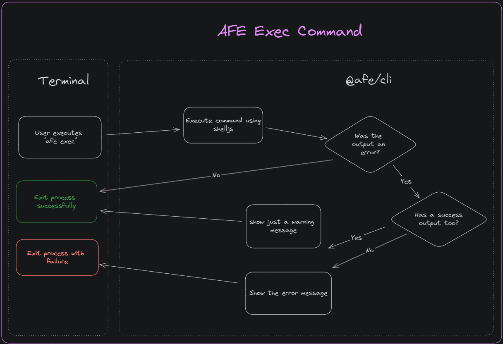

# Command for running routines

The ***exec command*** contained in the ***CLI*** allows you to execute any command that does not originate from ***@afe/cli*** (***version***, ***commit***, ***update***) or that encapsulates the ***@angular/cli*** (***new***, ***generate***) commands.

## Prerequisites

- Installing [***@afe/cli***](./index.md)

## Usage

To execute any command external to ***@afe/cli*** that is not a ***@angular/cli*** command, the command to be executed must be passed as an argument in literal format (in quotation marks ***"***) as an example:

``` BASH
afe exec "npm install"
```

## Functional Diagram

Check out the diagram below for the execution flow of the `exec` command:


