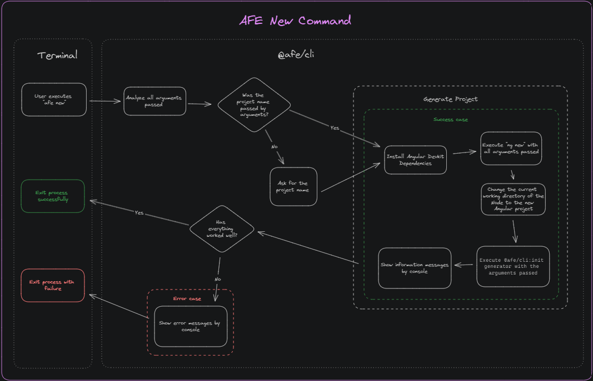

# Command for generating new projects

By using the `new` command, which contemplates the generation of new projects following the standardizations defined by AFE, it is possible to add the parameter `--type` to define which type of application will be generated.

They are:

| Command | Objective |
| ------- | --------- |
| [***application***](./application.md) | Creation of a **Common SPA** |
| [***library***](./library.md) | Creating a **library** |
| [***element***](./element.md) | Creation of a **self-contained** application, for projects that follow the micro front-end architecture |

> If the '--type' parameter is not passed to the command, a project of type ***application*** will be generated.

## Functional Diagram

Check out the diagram below for the execution flow of the `new` command:

