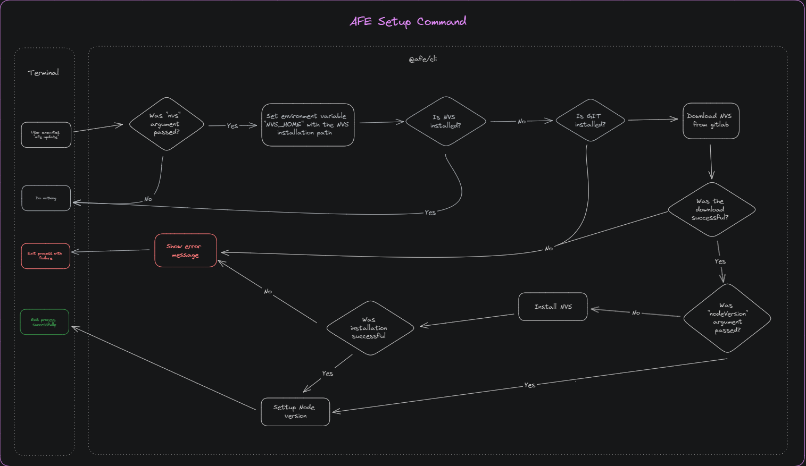

# Command for machine configuration

The ***setup*** command contained in the ***CLI*** is responsible for performing configurations on the developer's machine or directly in the projects in order to make it possible to use the features of the Front End Architecture.

## Prerequisites

- Installing [***@afe/cli***](./index.md)

## Usage

By running the 'afe setup' command the following actions will be taken

### NVS Configuration

[NVS](https://github.com/jasongin/nvs) is a tool that allows you to easily change the version of ***node*** used in the developer's terminal.

Although there is already a tutorial on [how to set up NVS](../../../getting-started/setup/nvs/index.md), this functionality has been added to the 'afe setup' command to simplify and meet the need for integration with the ***DevOps*** treadmill.

To use it you need to use the '--nvs' parameter:

It is possible to pass a predetermined version to be downloaded after installing ***NVS*** through the parameter ***nodeVersion*** as an example:

``` BASH
afe setup --nvs --nodeVersion 12
```

## Functional Diagram

Check out the diagram below for the execution flow of the `setup` command:


