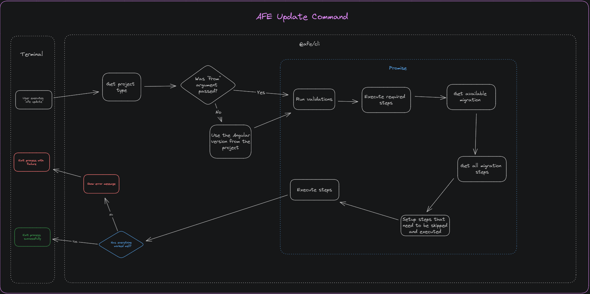

# Command for updating projects

The ***update*** command contained in the ***CLI*** is responsible for **running** the process of updating applications of type **application**, **element**, or **library** based on the arguments provided via the command line.

In this way, both the process of updating the framework, as well as the **standardizations** and **internal configurations** of the front-end architecture are transparent to the developer.

## Prerequisites

- Installing [***@afe/cli***](../index.md)

## Parameters

| Parameter | Type | Description |
| --------- | ----- | --------- |
| **--type** | ***string*** | Type of project to be migrated |
| **--step** | ***string*** | Name of the step to be executed, which can be 1 or more, separated by a comma |
| **--skipStep** | ***string***| Name of the step to be disregarded, which can be 1 or more, separated by a comma |
| **from** | ***number***| current version of ***Angular*** that the project is in. If nothing is passed, the version of the ***@angular/core*** package will be used to define the version of ***Angular*** being used. |

## Usage

### Updating the project

To update an application, run the following command in your project folder:

``` BASH
afe update --type=<PROJECT_TYPE>
```

> Replace '<PROJECT_TYPE>' with your application type ( ***application***, ***element*** or ***library***).

If no '--type' argument is passed, you will be asked the following question:

``` BASH
Select the type of project! › - Use arrow-keys. Return to submit.
❯ Library : a library to be published on artifactory.
Element: A self-contained application that uses the concept of Micro Front End.
Application: A common Angular application to be deployed to environments.
```

### Skipping Upgrade Steps

To skip one or more steps in the update process, proceed to [skipping update steps](./skip-step.md).

### Selecting Upgrade Steps

To resume running the update from a specific step, proceed to [selecting update steps](./step.md).

## Functional Diagram

Check out the diagram below for the execution flow of the `update` command:


