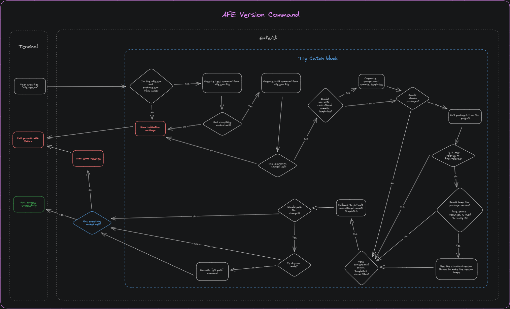

# Command execution

When you run the command, with the settings shown earlier:

``` BASH
afe version
```

If you configured the ***script*** in ***package.json***:

``` BASH
npm run version
```

It's possible to pass some arguments and parameters to the command:

## Arguments

Argument   | Description
----------- | ------------
`<version>` | Optional: Which version do you want the ***bump***. This can be a specific version or which element you want to increment (***9.9.9***, ***patch***, ***minor*** or ***major***). By default, the current version of the project is identified and, based on the commits, the "bump* of the version that meets the premises of [Conventional Commits](https://conventionalcommits.org) is made

## Parameters

Parameter | Description
----------- | ------------
***--package <*package-path*>*** | Specifies one or more packages that should have a generated version. This setting replaces the `version.packages` field of the `afe.json` file. E.g. `npm run version -- --package=lib/my-lib`
***--release-as <*version*>*** | It has the same role as the <*version*> argument, and can replace it
***--prerelease <*suffix*>*** | Generates a Pre Release version, also known as a *release candidate* or *beta*. Both the bump files, defined in the ***version.bumpFiles*** property of ***afe.json***, and the ***CHANGELOG.md*** are updated considering the suffix.Must be given the name of the pre-release suffix as a parameter. E.g. 'afe version --prerelease beta', which will result in ***1.0.0-beta.0***
***--first-release*** | Generates a version, updating the ***CHANGELOG.md***, but without bumping the files defined in the ***version.bumpFiles*** property of ***afe.json***
***--no-verify*** | If the repository has ***Git Hooks***, such as ***pre-commit***, configured, passing this parameter they will not be activated during the entire ***release*** process
***--silent*** | Performs the entire *release* process without performing any *output* on the *console*
***--dry-run*** | Simulates the entire process, displaying an *output* in the *console* of what the result would look like if it were executed without this parameter, but without actually changing anything
***--no-push*** | When the process is finished, it does not perform the push to the repository's *remote*

> Remember that if you are using the npm script (`npm run version`), you need to add a ***'--'*** separator between the command and the parameters. E.g. `npm run version -- --dry-run --first-release`

## Result

The expected result is an update to the version property, based on previous commits, to all files defined in the ***version.bumpFiles*** property of ***afe.json***, update of CHANGELOG.md, the commit of both changes, and the generation of a git tag.

Finally, the repository is sent to the *remote* of the repository through the command below:

``` BASH
git push --follow-tags
```

> If you don't want this to be sent, just add the '--no-push' parameter to the command. That way, you'll need to run it manually.

## Functional Diagram

Check out the diagram below for the execution flow of the `version` command:


