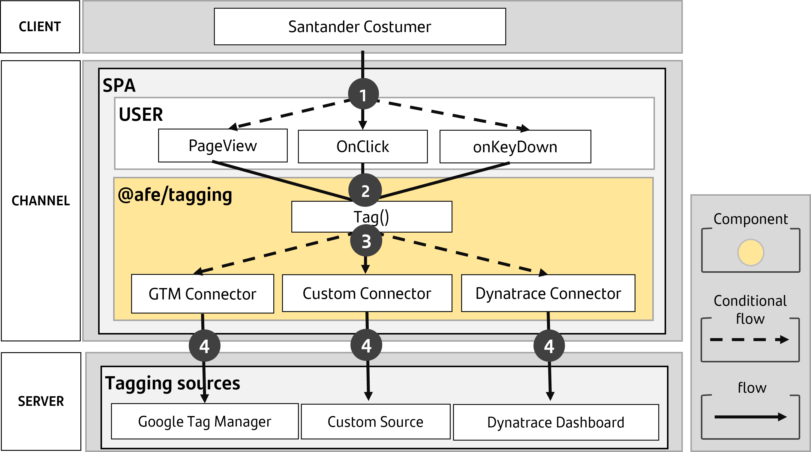

# Tagging

The **@afe/tagging** is the component responsible for tagging Angular projects in the Santander environment, handling the sending of user interaction events to third-party platforms such as Dynatrace, Google Tag Manager, or custom sources.

> **Macro Process**
>
> **1.** The user interacts with the page by clicking a button, viewing a page, or filling out a form field.
>
> **2.** The application configures @afe/tagging and performs tagging using the tag method of the TaggingService.
>
> **3.** The @afe/tagging propagates the tagged event to all configured connectors, such as Google Tag Manager, Dynatrace, or custom sources.
>
> **4.** The @afe/tagging adapts the event for each configured data source.

### Macro Solution Diagram

> **Macro Process**
> **1** The user interacts with the page by clicking a button, viewing a page, or filling out a form field.
>
> **2** The application configures @afe/tagging and performs tagging using the **tag** method of the TaggingService.
>
> **3** The @afe/tagging propagates the tagged event to all configured connectors, such as Google Tag Manager, Dynatrace, or custom sources.
>
**4** The @afe/tagging adapts the event for each configured data source.

## Compatibility

Using the table below and based on the version of Angular in your project, follow the **steps described in the documentation** for **installation** and **configuration** from the version of the designer.

| Angular Version | Structuring version |
| ------------------------------------| ---------------------------------------- |
| v18 | [v18](./v18/index.md) |
| v16 | [v4](./v4/index.md) |
| v8 v10 | [v2](./v2/index.md) |
