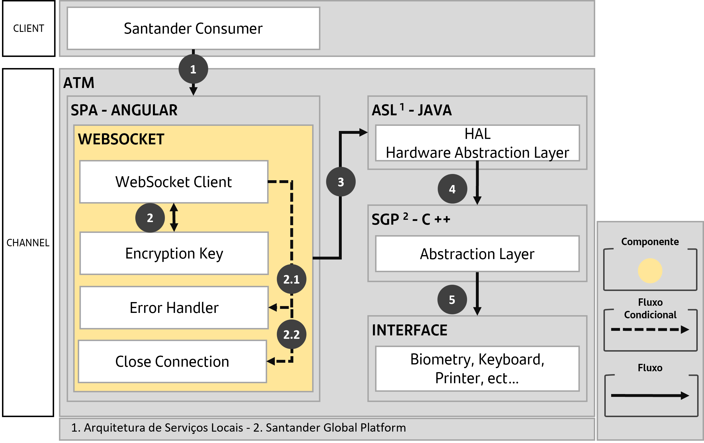

# Websocket Action Runner

***@afe/websocket-action-runner*** is a library built by AFE architecture with the mission of encapsulating WebSocket technology and providing a configuration and functionality facilitator.

> WebSocket is a technology that allows for a two-way connection.
>
> This connection allows a web server to establish a communication channel with the browser and communicate directly with it, in other words, during the connection period, **the server can send any messages directly to the browser and vice versa**.
>
> More information at [Mozilla WebSockets](https://developer.mozilla.org/pt-BR/docs/WebSockets).

### Macro Solution Diagram

> **Macro Process**
>
> **1.** The client wants to use Santander ATM functionalities.
>
> **2.** In the ATM, the SPA has a LIB that is enabled through an encrypted key exchange, establishing a WebSocket connection with the ASL to communicate with the HAL.
>
> **2.1.** If there is an issue with the key exchange, a generic error is triggered (this error needs to be handled individually).
>
> **2.2.** After the error, the initiated connection is closed.
>
> **3.** If the key exchange is successful, the connection is stabilized and data traffic is authorized with access to the HAL.
>
> **4.** The HAL communicates with the SGP, which manages the requests for the interface.
>
> **5.** Access the interface as per the client/user request.

## Compatibility

Using the table below and based on the version of Angular in your project, follow the **steps described in the documentation** for **installation** and **configuration** from the version of the designer.

| Angular Version | Structuring version |
| ------------------| --------------- |
| v16 | [v4](./v4.md) |
| v8 v10 v12 | [v3](./v3.md) |
