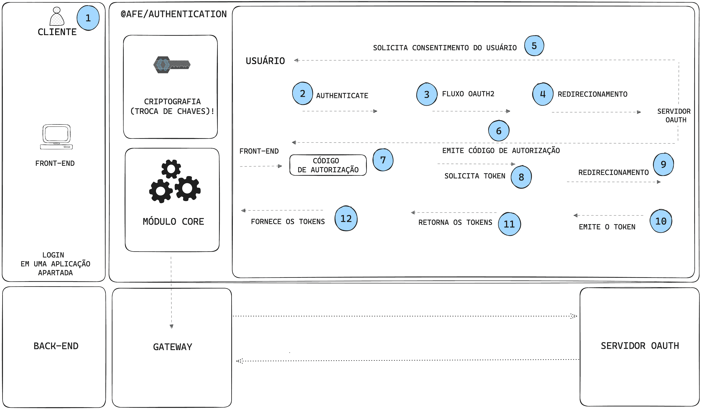

# How to authenticate via OpenID Connect on Apigee

## Authentication via OpenID Connect on Apigee

This is an illustration showing the authentication flow via OpenID Connect on Apigee.

??? Info "Steps of the authentication flow via OpenID Connect on Apigee"
    **📝 Step by step:**

     1. User makes a request to access a protected resource.
     2. The ***authenticate*** method is called.  
     3. Initiates the **OAUTH2 Authorization Code** flow.  
     4. Redirection to the **OAUTH** server.  
     5. The server requests user consent.  
     6. After consent, an **authorization code** is issued.  
     7. The **authorization code** is captured by the front-end.  
     8. Requests the **access token** using the **authorization code**.  
     9. Redirection to the **OAUTH** server.  
     10. The **access token** is issued.  
     11. The access tokens are returned: **access_token and refresh_token**.  
     12. The ***@afe/authentication*** manages the access tokens.  

In this guide, we'll show you how to do referral authentication in Apigee, using the RH-SSO server in the OAuth2 OpenID Connect process to acquire the access token. This token enables resource consumption in the services HUB.

In this session we will cover how to perform this process through the ***@afe/authentication/oauth2*** library.

Responsible for performing authentication for communication with the ***Apigee*** gateway, managing the tokens obtained and adding the access token in the consumption of an API (service).

## 🎓 What will you learn?

- [Prerequisites](./pre-reqs.md)
- [Project configurations](./configurations.md)
- [APIGEE Authentication](../apigee-authentication.md)
- [APIs Consume on Service HUB](../api-consume.md)
- [Refresh Policy](../refresh-policy.md)
- [Refresh Token Manually](../refresh-token.md)
- [Revoke Token](../revoke-token.md)
