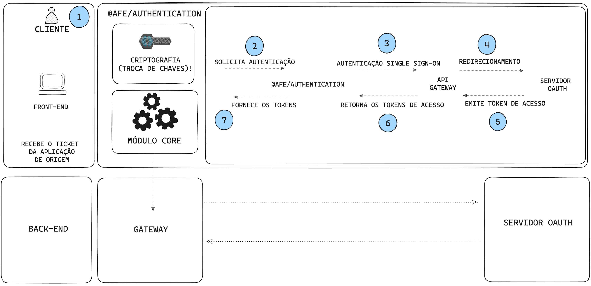

# How to authenticate via SSO Ticket on Apigee

## Authentication via SSO Ticket in Apigee

This is an illustration showing the authentication flow in the coexistence login between Zup and Apigee

??? Info "Steps of the Authentication Flow in the Coexistence Login between Zup and Apigee"
     **📝 Step by Step:**

     1. User makes a request to access a protected resource.
     2. The ***authenticate*** method is called.
     3. **Single sign-on (SSO)** authentication is requested. Provides the coexistence headers.
     4. Redirection to the **OAUTH** server.
     5. The **access token** is issued.
     6. The access tokens are returned: **access_token and refresh_token**.
     7. The ***@afe/authentication*** manages the access tokens.

In this guide, we'll show you how to do referral authentication on Apigee, using the SSO Ticket pattern to acquire the access token. This token enables resource consumption in the services HUB.

> [**SSO Ticket**](https://confluence.santanderbr.corp/display/SOLSEG/SSO+Ticket) authentication is used for already authenticated applications **(Source Application)**.
> That need to pass the authenticated user's context to another **(Target Application)** application, thus generating a new session without the need to request the user's Credentials again.

In this session we will cover how to perform this process through the library ***@afe/authentication/sso-ticket***.

Responsible for performing authentication for communication with the gateway ***Apigee***, managing the tokens obtained and adding the access token in the consumption of an API (service).

## 🎓 What will you learn?

- [APIGEE Authentication](../apigee-authentication.md)
- [API Consume](../api-consume.md)
- [Prerequisites](pre-reqs.md)
- [Project Configurations](configurations.md)
- [Refresh Policy](../refresh-policy.md)
- [Refresh Token](../refresh-token.md)
- [Revoke Token](../revoke-token.md)
