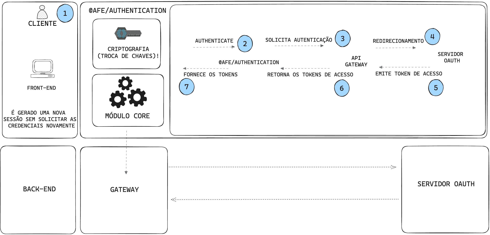

# How to Authenticate in the Coexistence Login between ***Zup*** and ***Apigee***

## Authentication in the Coexistence Login between Zup and Apigee

This is an illustration showing the authentication flow in the coexistence login between Zup and Apigee.

??? info "Steps of the Authentication Flow in the Coexistence Login between Zup and Apigee"
     **📝 Step by Step:**

     1. User makes a request to access a protected resource.
     2. The ***authenticate*** method is called.
     3. **Single sign-on (SSO)** authentication is requested. Provides the coexistence headers.
     4. Redirection to the **OAUTH** server.
     5. The **access token** is issued.
     6. The access tokens are returned: **access_token and refresh_token**.
     7. The ***@afe/authentication*** manages the access tokens.

***Apigee***, the API Gateway used by Santander. In this documentation, we will teach how to manage the coexistence of consumption between it and the old gateway, **Zup** (***discontinued***).

> **⚠️ Note**
>
> **This coexistence tutorial is only supported for Angular versions 10 and 12.**
>
> If your application is in Angular 8, follow the documentation for the implementation of the [coexistence login - version 1](https://confluence.santanderbr.corp/pages/viewpage.action?pageId=336736892), discontinued due to ***security vulnerabilities***.

## 🎓 What will you learn?

- [Prerequisites](./pre-reqs.md)
- [APIGEE Authentication](../apigee-authentication.md)
- [API Consume](../api-consume.md)
- [Configurations](configurations.md)
- [Refresh Policy](../refresh-policy.md)
- [Refresh Token](../refresh-token.md)
- [Revoke Token](../revoke-token.md)
