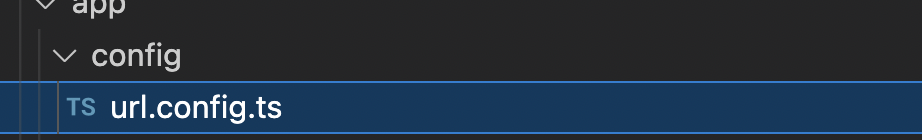

# URL storage

All resource URLs and APIs used by the channel should be centralized in a file called ***url.config.ts***, in a ***config*** folder.



An object wrapped in the 'Object.freeze()' method of Javascript should be exported to immutabilize the values declared by the development team, preventing malicious changes from being made at runtime.

``` TS
export const urlConfig = Object.freeze({
  urlHubExemplo: '/hub-url/exemplo?gw-app-key=<YOUR_APP_KEY>',
});
