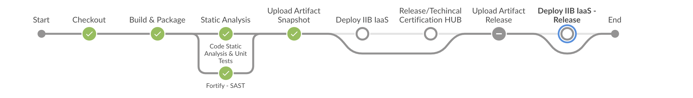

# Beta Versions

It is common during development to need to generate ***beta*** versions to pre-validate the functionality before generating a final version.

As in Santander's DevOps environment it is not possible to publish the same version several times.

It is necessary to generate the versions with a suffix that can be ***beta*** or, more appropriately, the ***ID*** of the activity in Jira from which the development originated.

In order not to change the ***branch*** of development, with these version changes a new ***branch*** will be created following a naming pattern of ***branch*** ***rc***.

The suffix for this type of ***branch*** will be the version that will be generated after the delivery is complete, but you can also use the activity ID in Jira as a suffix

Once the version is changed to contain its own suffix, this branch will be used in the DevOps pipeline.

It is important to note that after performing the step of publishing the package to ***snapshot*** the ***build*** must be aborted so that it does not generate a ***release***.

The purpose of this branch is just to go through the pipeline and generate the beta versions.

Development will continue to be done from the ***branch*** of ***feature*** or ***bugfix*** and whenever there is a need to generate a new ***beta*** version the ***beta*** should be done ***pull*** from the ***commits*** to that ***branch*** ***rc***.

When you finish developing this change, this ***branch*** should be deleted.
