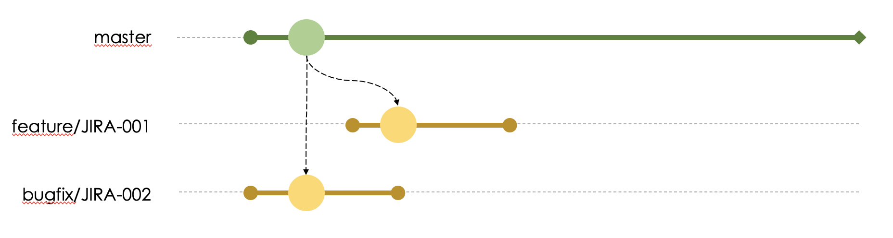
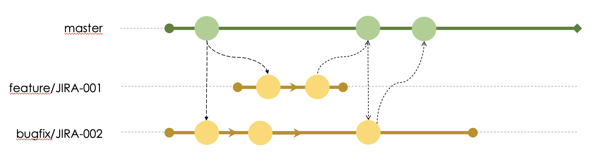

# Development

Any development of new functionality or bug fixes must come from the ***branch*** ***master***.

> In this case, it's ideal to use the ***ID*** of the ***issue*** in Jira to compose the ***branch nomenclature***.

When the development of the change is finished, a ***Merge Request***, or just ***MR***, should be opened for the ***branch*** ***master***.

> If before your MR is approved, another branch has been merged into the ***branch*** ***master*** you need to pull the changes to avoid conflicts and test that everything will still work.

After approval of the ***MR*** it is possible to proceed with the versioning procedure.

> When creating MR, select the option to delete the MR after it is approved to remove the development branch when the flow is completed.
