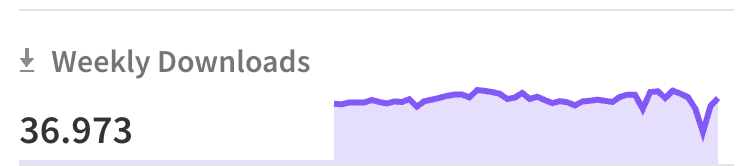
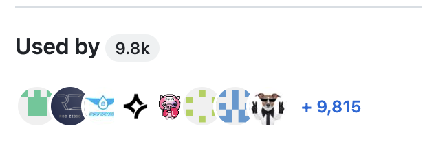
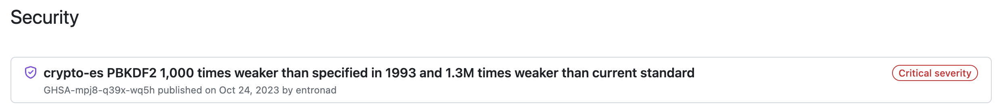
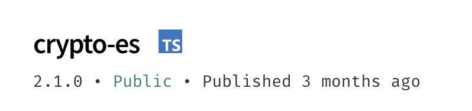

# Best practices in the choice of third-party libraries

When we choose third-party libraries to use in our project, we must be aware that we are adding code that is not maintained by us in our application.

Therefore, it is important to verify that the libraries are **reliable**, **maintainable** and that **they will not compromise the security of the application** or evolution of the project.

Some of the best practices we should follow when choosing third-party libraries are:

## Check the popularity of the library

A library that is used by many users and has an active community is usually a safe choice. You can check the popularity of a library by looking at:

- Number of **stars on GitHub;**
- Number of **downloads on ***NPM*****;
- Number of **library contributors;**
- Number of **Open Issues** vs **Closed Issues**;
- Date of last publication;

If the last update was a long time ago, it may be a sign that the library is no longer being maintained, which directly implies the absence of:

- **Bug fixes**: Flaws in the code that can cause problems in your app will not be fixed.
- **Security updates**: Dependency with security vulnerabilities or vulnerable code will not be updated

## Scan for known vulnerabilities

Use tools such as [Snyk](https://security.snyk.io/) or ['npm audit'](https://docs.npmjs.com/cli/v10/commands/npm-audit) to check your library for known vulnerabilities.

**Avoid using libraries with unpatched security vulnerabilities.**

Another alternative is to check the **Security** tab of Github, where you can check if the library has already been reported for known vulnerabilities.

## Use the latest version that is compatible with your application

Always use the latest version of the library, as they often include **bug fixes** and **security updates**. However, make sure that the latest version is compatible with your application before upgrading your project with the new version.

## Prefer *vanilla* libraries or libraries with few external dependencies

When choosing a library, **make sure it has too many external dependencies.** The more external dependencies, the greater the chance that one of them will have security vulnerabilities or that it will no longer be maintained.

This creates a dependency loop between packages. Instead, give preference to libraries that use native browser features rather than other dependencies that can do the same.
