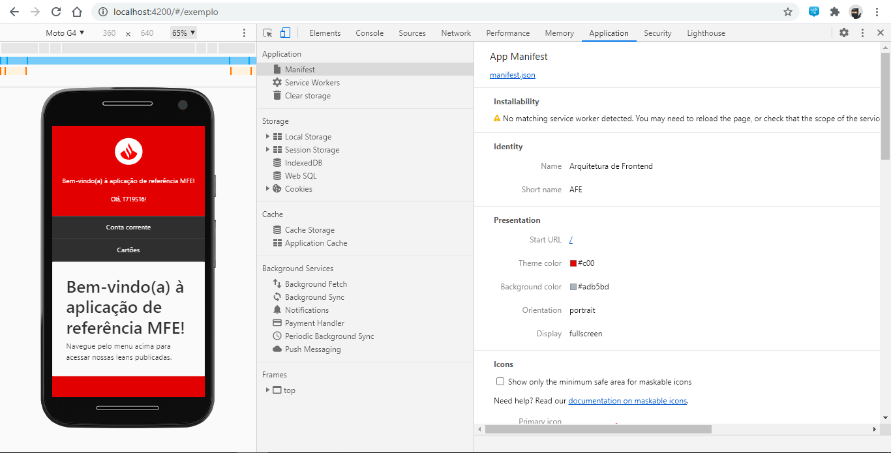

# How to Create a Web App Manifest

This walkthrough is intended to demonstrate how to create and configure a manifest for your application.

We will implement the procedure in the MFE APP of our [reference application](https://afe.paas.isbanbr.dev.corp/).

## Prerequisites

- Read about [***What is a Web App Manifest?***](./index.md).

## Manifesto Creation

The file can be created from scratch, configuring the properties as needed by the project. However, for the minimum configuration of the manifest, we can resort to generators that help in the preparation of the document.

Below we leave some examples that may be useful.

- <https://app-manifest.firebaseapp.com/> : includes basic properties of the manifest and even allows you to generate icons of different sizes.
- <https://tomitm.github.io/appmanifest/> : is more comprehensive in relation to manifest properties and also suggests some supporting tags for the `<head>` application'.

> <https://www.flaticon.com/> : It's not a manifest generator but they have wide range of vector icons for free.

We'll create the **manifest.json** file in the project's source*** (src), along with the application's **index.html**.

> The concept and description of each property can be seen in the documentation [Properties of a manifest](./properties.md) as required to read.

```json
{
    "name": "Arquitetura de Frontend", // Nome do aplicativo web que será exibido ao usuário na tela do usuário.
    "short_name": "AFE", // A abreviatura do nome do aplicativo.
    "description": "Web App Manifest para Aplicação de Referência MFE", // Fornece a descrição do seu aplicativo web.
    "dir": "ltr", // Define a direção do texto da aplicação.
    "lang": "pt-BR", // Informa o idioma no qual a aplicação foi escrita.
    "scope": "/", //  Define um escopo de navegação para o aplicativo web.
    "start_url": "/", // Especifica contexto da aplicação a ser aberto quando for iniciada através do atalho na tela inicial.
    "display": "fullscreen", // Customiza a interface de usuário fornecida pelo navegador ao iniciar o aplicativo web.
    "orientation": "portrait", // Define uma orientação de tela padrão dentro do contexto do browser.
    "theme_color": "#c00", // Define uma cor personalizada para a barra de tarefas da aplicação.
    "background_color": "#adb5bd", // Define a cor do fundo que será utilizada enquanto a aplicação está sendo carregada.
    "icons": [ // Define os ícones que estarão na tela inicial do dispositivo.
        {
            "src": "assets/pwa-icons/icon-512x512.png",
            "sizes": "512x512",
            "type": "image/png",
            "purpose": "maskable any"
        }
        // Demais ícones com tamanhos diferentes.
    ]
}
```

For the **icons** property, we create the icons inside the **./src/assets/pwa-icons/** folder and reference them in the manifest file, as the images will be available in the application's **./assets/pwa-icons/** folder after the project build.

With the manifest created, it is possible to validate if it is in accordance with the rules of the ***W3C*** specification, through the website: [***Manifest Validator***](https://manifest-validator.appspot.com/).

## In-App Deployment (***APP MFE***)

For the browser to identify the created manifest, simply add it to the application's **index.html**, through the ***tag*** **link**.

```html
<!-- Required Elements for PWA -->
<link rel="manifest" href="manifest.json">
<meta name="viewport" content="width=device-width, initial-scale=1, shrink-to-fit=no">
```

Referencing the manifest in the index is enough for the browser to identify the information of an installable web application, but as an extra: for some browsers (Safari and Internet Explorer, for example).

It is possible to include some meta and link to get some native app experiences.

```html
<!-- Basic elements to supported Browsers -->
<meta name="theme-color" content="#c00">
<meta name="application-name" content="AFE">
<meta name="mobile-web-app-capable" content="yes">

<!-- Support elements to Microsoft OS Browser -->
<meta name="msapplication-starturl" content="/">
<meta name="msapplication-navbutton-color" content="#c00">

<!-- Support elements to iOS Browser -->
<meta name="apple-mobile-web-app-capable" content="yes">
<meta name="apple-mobile-web-app-title" content="AFE">
<link rel="apple-touch-icon" href="assets/pwa-icons/apple-touch-icon.png">
<meta name="apple-mobile-web-app-status-bar-style" content="black-translucent">
```

> To stand out the importance of the user experience with the navigation of the application because the process of making it available as an installable "app" ends up differentiating it from an application that we access directly through the browser.

Since depending on the configuration of the **display** property of the manifest, the browser interaction tools will no longer be available.

So you must provide a single-page application solution by offering back buttons within the ***UI*** of the user (***User Interface***).

By serving the application locally, it is possible to validate that the manifest has been loaded and identified by the browser.

Access your application in the ***Chrome*** browser -> open ***DevTools*** (***ctrl + shift + I***) -> navigate to ***Application*** -> click ***Manifest***.



With what we have done, **we can give as valid the creation of the Web App Manifest**, our manifest is present in the application, we can even check the configured information.

However, notice that we have an alert in the manifest information by the browser in the **installability** topic, informing that a ***worker***.

This ends up not allowing installation as an application, but once we have a ***worker*** configured (subject for another documentation).

This alert ceases to exist and we will have the option to install the application on the device screen as a native application.
