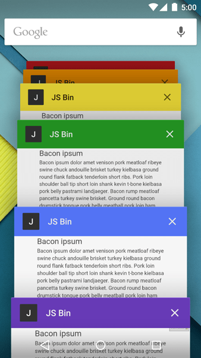

# Properties of a manifest

The ***manifest.json*** file must be created at the root of the project and contain the following properties, which are responsible for providing information about the application, such as:

## name

The name of the web application that will be displayed to the user.

```json
{
    "name": "Arquitetura de Front-End"
}
```

## short_name

he **abbreviation** of the app's name. This property can't exceed 12 letters, as it's the name that will appear below the app's icon.

```json
{
    "short_name": "AFE"
}
```

## background_color

Sets the background color that will be used while the splash screen of your web application is visible to the user.

```json
{
    "background_color": "#cc0000"
}
```

## description

Provides the description of your web application.

```json
{
    "description": "The Architecture front-end helps you to turn your app in an PWA."
}
```

## icons

The ***icons*** property defines the icons that will be on the device's home screen. It expects an array of objects, and each object must have the following properties:

| Property | Description |
| ----------- | --------- |
| **src** | Path to Icon |
| **sizes** | The Icon Dimensions |
| **type (optional)** | icon format. It is recommended that it be in the format ***png***; |

> The icon array must have at least one icon of **512x512**;

```json
{
    "icons": [
        {
            "src": "/images/icons/afe-icon-192.png",
            "type": "image/png",
            "sizes": "192x192"
        },
        {
            "src": "/images/icons/afe-icon-512.png",
            "type": "image/png",
            "sizes": "512x512"
        }
    ],
}
```

On android devices, icons may appear with a white background, which makes it aesthetically unpleasing. In these cases, you can use adaptive icons (known as [maskable icons](https://web.dev/maskable-icon/)) that fill the entire icon shape.

To enable them, you need to adapt existing icons and add the ***purpose*** property to your ***icons*** array.

```json
{
    "icons": [
        {
            "src": "/images/icons/maskable-icon.png",
            "type": "image/png",
            "sizes": "512x512",
            "purpose": "any maskable"
        }
    ],
```

## dir

Sets the direction of the application text. It can have the following values:

| Property | Description |
| ----------- | --------- |
| **ltr (left-to-right)** | From Left to Right |
| **rtl (Right-to-Left)** | From right to left |
| **auto** | The browser automatically detects the direction of the text through an algorithm |

```json
{
    "dir": "ltr"
}
```

## lang

Informs the language in which the application was written.

```json
{
    "lang": "pt-BR"
}
```

## orientation

The ***orientation*** property sets a default screen orientation within the **browser context**, such as a new window or tab. Valid values for this property are:

| Property | Description |
| ----------- | --------- |
| **any** | Orientation is unlocked - all orientations are supported. |
| **natural** | It can take on the value of ***portrait-primary*** or ***landscape-primary***, depending on the orientation of the device. This guidance is usually provided by the underlying operating system (in the case of a mobile device, it can be given by android or iOS).|
| **landscape** | The orientation can be either primary landscape or secondary landscape (identified by the device's sensor). |
| **landscape-primary** | The orientation is in the main landscape mode. |
| **landscape-secondary** | The orientation is in secondary landscape mode. |
| **portrait** | Orientation can be primary portrait or secondary portrait (identified by the device's sensor) |
| **portrait-primary** | The orientation is in the main portrait mode. |
| **portrait-secondary** | The orientation is in secondary portrait mode. |

> For more detailed information on the available values, see the W3C documentation on [orientation types and locks](https://www.w3.org/TR/screen-orientation/#screen-orientation-types-and-locks)

## start_url

Specifies which application's path will open when the user launches the web application via the shortcut on the home screen.

```json
{
    "start_url": "/aplicacao-referencia/?source=pwa"
}
```

## theme_color

The ***theme_color*** property sets a custom color for your app's taskbar, as shown in the example below:

```json
{
    "theme_color": "#cc0000"
}
```



## display

The display property customizes the user interface provided by the browser when launching the web app, such as removing the address bar and back and reload buttons, making the experience as faithful as possible to a native app.

```json
{
    "display": "standalone"
}
```

The available values for this property are:

| Property | Description |
| ----------- | --------- |
| **fullscreen** | It opens the web app without any user interface, other than it consumes the entire screen. |
| **Standalone** | Opens the web app in its own window and removes the UI provided by the browser, making the experience closer to a native app. |
| **minimal-ui** | Similar to Standalone, but retains the Back and Reload buttons. |
| **browser** | Provides the standard experience of a browser. |

> You can customize your app's CSS based on the display mode using **@media** ***display-mode***. For more information, see the [MDN documentation.] (<https://developer.mozilla.org/pt-BR/docs/Web/CSS/@media/display-mode>)

## scope

The scope property defines a navigation scope for the web application. In this way, if the user navigates to a ***path*** that is not within the one defined in the property.

The browser will understand that he is accessing a normal web page and no longer a ***PWA***.

```json
{
    "scope": "/aplicacao-referencia/",
}
```

## prefer_related_applications

The ***prefer_related_applications*** property expects a 'boolean' and tells the browser if it should suggest the user install the **native app** instead of the **web app**. If its value is 'false', it will suggest installing the web app.

It should be used in conjunction with ***related_applications***, if it is set to 'true'.

```json
{
    "prefer_related_applications": false
}
```

## related_applications

This property should be used in conjunction with ***prefer_related_applications*** and is given an array of objects, containing the ***native applications*** related to the **web application**.

The object expects the following properties:

- **platform**: platform on which the application was made available;
- **id**: App ID related to the native app.

| Property | Description |
| ----------- | --------- |
| **platform** | platform on which the application was made available. |
| **id** | App ID related to the native app. |

```json
{
    "prefer_related_applications": true,
    "related_applications": [
        {
            "platform": "play",
            "id": "com.google.samples.apps.iosched"
        }
    ]
}
```

## shortcuts

Recently, the [app manifest](https://www.w3.org/TR/appmanifest/#shortcuts-member) specification added the ***shortcurts*** property, which allows you to create shortcuts to different ***features*** of your application.

It consists of an array of objects, which expects the following properties:

- **name**: Label for the icon that will be presented to the user
- **Description**: Summary of the purpose of the shortcut
- **url**: URL that will open to the user clicking the shortcut
- **icons**: An array of icons for the shortcut. Must have the properties ***src*** and ***sizes*** set

| Property | Description |
| ----------- | --------- |
| **name** | Label for the icon that will be presented to the user |
| **description** | Shortcut Purpose Summary |
| **url** | URL that will open to the user clicking on the shortcut |
| **icons** | an array of icons for the shortcut. It should have the ***src*** and ***sizes*** properties set. |

```json
"shortcuts": [
    {
        "name": "Conta",
        "description": "Editar as configurações da conta",
        "url": "/configurations/",
        "icons":
        [
            {
                "src": "/icons/config.png",
                "type": "image/png",
            }
        ]
    }
]
```

> For more information, [see the article on app shortcuts.](https://web.dev/app-shortcuts/)

## Example of manifest.json

```json
// manifest.json
{
    "short_name": "AFE",
    "name": "Arquitetura de Front-End",
    "description": "A arquitetura de front-end te ajuda a transformar sua aplicação numa PWA",
    "lang": "pt-BR",
    "icons": [
        {
            "src": "/images/afe-192.png",
            "type": "image/png",
            "sizes": "192x192"
        },
        {
            "src": "/images/afe-512.png",
            "type": "image/png",
            "sizes": "512x512"
        }
    ],
    "start_url": "/aplicacao-referencia/?source=pwa",
    "background_color": "#3367D6",
    "display": "standalone",
    "scope": "/aplicacao-referencia/",
    "theme_color": "#3367D6"
}
```
