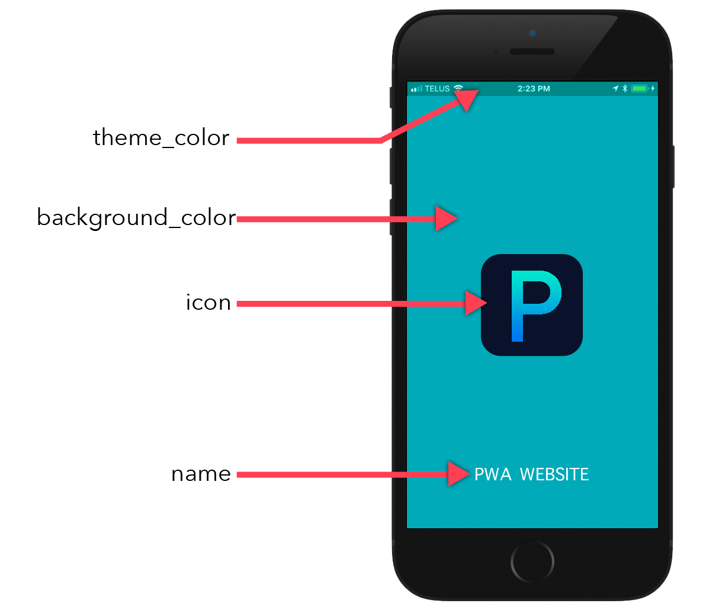

# Splash Screen

A **Splash Screen** is displayed whenever the **web app** is launched by its shortcut on the home screen. It is created automatically through the following properties:

- ***name***
- ***background-color***
- ***icons***

