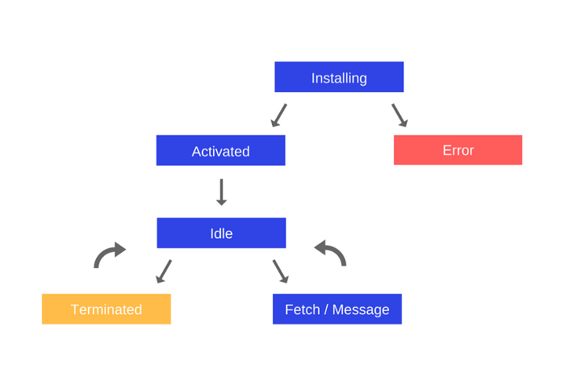
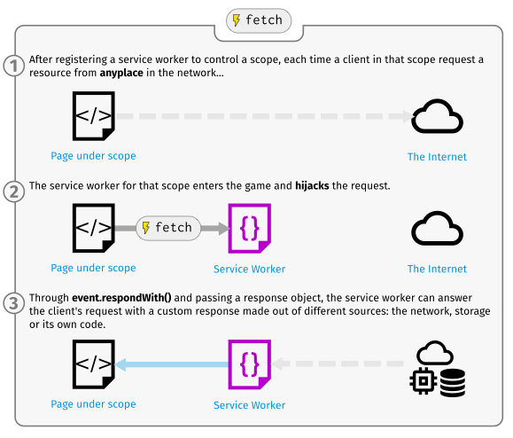

# Life Cycle

A SW has its life cycle completely separate from your web page, and the main flow includes the following steps:

## Registration

The SW is a property of the navigator object in the browser window, and it is downloaded when we use the ***.register()*** function.

The method must have as a parameter the path of the SW to be registered, and if the ***script*** fails to download, parse or trigger itself, an error is thrown, the registration promise is rejected and the SW is discarded.

```js
// Service Worker registry example
if('serviceWorker' in navigator) {
  navigator.serviceWorker
    .register('sw.js')
    .then(function() {
      console.log("Service Worker registered successfully");
    })
    .catch(function() {
      console.log("Service Worker registration failed")
    });
}
else {
    console.log("Service Worker not supported");
}
```

## Installation

Registering an SW causes the browser to start the installation step in the background, at this point, this is where static resources are stored in ***cache***.

If all files are stored correctly, the SW is installed, if any file is failed to download and cache*** the installation step will fail and the SW will not be activated (i.e. will not be installed), if this occurs, there will still be a retry next time.

```js
self.addEventListener("install", async e => {
    console.log("SW installed");
    const cache = await caches.open("pwa-static");
    const files = [ "./", "./main.js", "./styles.css", "./noconnection.json" ];
    cache.addAll(files);
});
```

## Activation

This step is a great opportunity to manage previous caches, once enabled, the SW will start tracking all pages that are in its scope (note: the page that first registered the SW will not be tracked until it is loaded again).

Once the SW is in control, it is in one of the following states:

- (a) handling the fetch and message events that occur when a request or network message is made from the page;
- (B) Finished to save memory.

```js
// Exemplo do Evento de Ativação
self.addEventListerner("activate", () => {
    console.log("SW activated");
});
```

Below is a simplified version of the life cycle of a SW.



Once registered, installed and active, the SW has functional events for network management needs:

## Search Event

In this step, we can track and manage the page's network traffic by checking the existing cache, managing requests first from the cache or network, and returning the desired response.

There are other caching strategies, but the main ones are Cache First and Network First.

- **Cache First** : If the incoming request has already been stored in ***cache***, this will be the response returned to the page. But if not, the request for a new response is made over the network.
- **Network First** : we try to get an updated response from the network, if this process is completed successfully, the new response will be stored in ***cache*** and returned.
- But if this process fails, we check whether the request has been cached before or not.
- If the cache exists, it will be returned to the page, but if not, it's up to you to decide what to do (e.g., return dummy content or informational message to the page).

```js
// Search event example
self.addEventListener("fetch", function (event) {
    const req = event.request;
    const url = new URL(req.url);

    if(url.origin === location.origin) {
        event.respondWith(cacheFirst(req));
    }
    else {
        event.respondWith(newtworkFirst(req));
    }
});

async function cacheFirst(req) {
    return await caches.match(req) || fetch(req);
}

async function networkFirst(req) {
    const cache = await caches.open("pwa-dynamic");
    try {
        const res = await fetch(req);
        cache.put(req, res.clone());
        return res;
    } catch (error) {
        const cachedResponse = await cache.match(req);
        return cachedResponse || await caches.match("./noconnection.json");
    }
}
```

The following graphic shows the details pertaining to the search event.



## Synchronization Event

Background sync is a web API that allows you to delay a process until your internet connection is stable.

- Example: adapting this definition to the real world -> an email client application that works in the browser and we want to send an email with this tool.
- The internet connection was interrupted while we were writing the content of the email and we didn't realize it;
- When we finish writing, we click on the send button, even without the internet the worker will be checking the status of the network and when stability returns, the sending occurs normally.

```js
// Sync event example
// Event Listener for Background Sync Logging
document.querySelector("#button-sw").addEventListener("click", async () => {
    var swRegistration = await navigator.serviceWorker.register("sw.js");
    swRegistration.sync.register("helloSync").then(function () {
        console.log("helloSync sucess [index.html]");
    });
});
```

```js
// Sync event example
// Event Listener to sw.js
self.addEventListener("sync", event => {
    if (event.tag === "helloSync") {
        console.log("helloSync [sw.js]");
    }
});
```

## Push Event

It handles the push notifications received from the server, and can apply any method with the received data.

```js
// Push Event example
self.addEventListener("push", event => {
    if (event && event.data) {
        const data = event.data.json();
        if (data.method === "pushMessage") {
            event.waitUntil(
                self.registration.showNotification("Example Message", { body: data.message })
            );
        }
    }
});
```

The chart below demonstrates the SW lifecycle and events in a bit more detail.

! [(Life Cycle + Events) Detailed!](../../../../../images/pwa/ciclo-de-vida-service-worker-e-eventos-detalhado.png)
