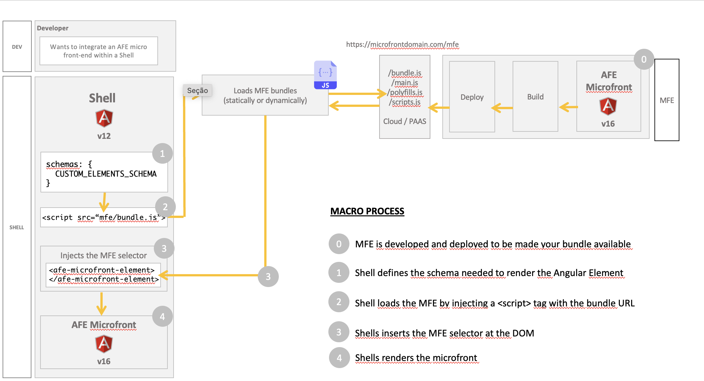

# Which type of architecture to use?

The project should be analyzed in a **macro** way, aiming at **scalability** and **time** regarding development, testing, maintenance, execution and even learning curve for new people who may join the team.

Knowing which one provides advantages in terms of time and productivity within the mentioned scenario, it is possible to identify which architecture to choose.

## Use Cases

### SPA

A new application that will consume few services and have simple business rules can make use of the **SPA** architecture, suitable for **less complexity** applications that have **low probabilities** of needing to be **scaled** in the future.

### MFE

A project will be born to accommodate other fronts, such as a portal that interconnects several other projects, thus having a high probability of having **several modules**.

In this case, the **indicated** is to use the **micro front-end** architecture, because due to their size, segregating them into other applications makes it easier to **maintain**.

In this architectural model, a Shell (container) application loads and orchestrates Micro Front-ends for interface composition, session management, navigation, and application state. The Micro Frontend provides the functionality.

The diagram below shows this integration.

In the [development guides with Angular Elements](../../../development-guides/mfe/angular-elements/index.md) section, you can understand how to create and load Micro Front-end applications in existing shells.

> If you want to know more information, check out the [differences between monolithic applications and micro front-ends](spa-vs-mfe.md).
