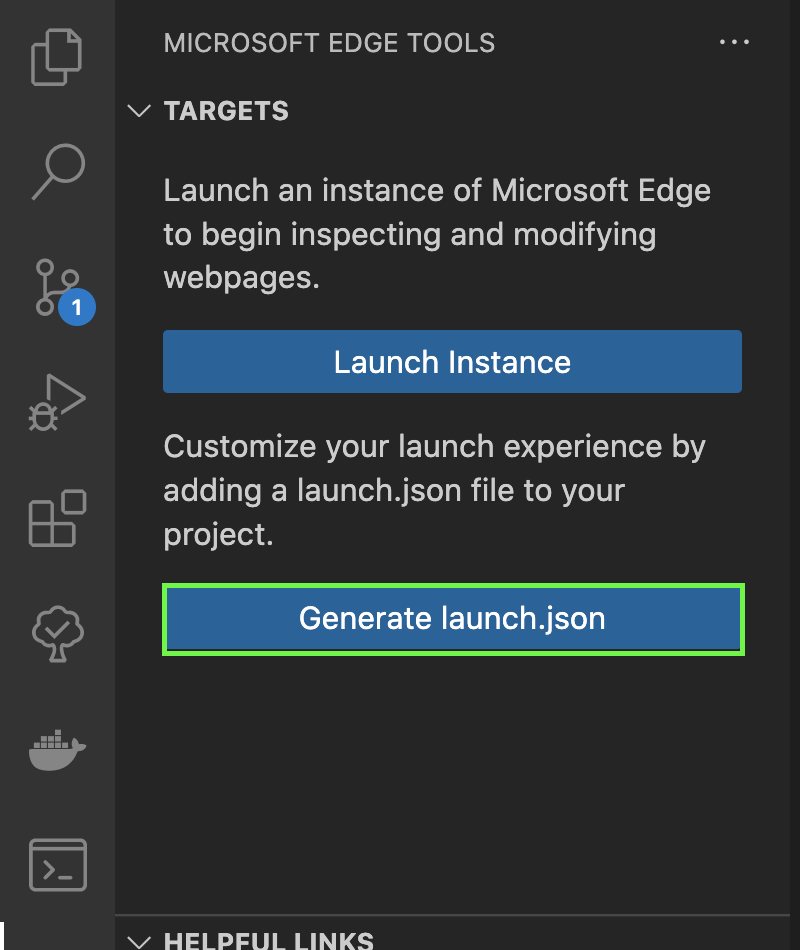
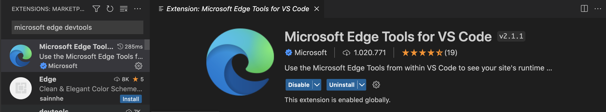

# Debugging no VSCode

To debug your application using VSCode's debugger, it is recommended to install the [Microsoft Edge Tools](https://learn.microsoft.com/pt-br/microsoft-edge/visual-studio-code/microsoft-edge-devtools-extension) extension.



After installing the indicated extension, an icon will be available in the sidebar with the Microsoft Edge symbol.

To configure it, click on the icon and press **Generate launch.json**.



With this, a ***launch.json*** file will open. Configure it according to your project:

```json
{
"configurations": [
  {
      "type": "msedge",
      "name": "Launch Microsoft Edge",
      "request": "launch",
      "runtimeArgs": [
          "--remote-debugging-port=9222"
      ],
      "url": "http://localhost:4200", // A url para acessar seu projeto localmente
  },
}
```

> Several values can be set in the ***type*** property, such as: ***chrome***, ***pwa-chrome*** and ***pwa-edge***.

Once this is done, start your project using the 'npm start' command and access the **Run and Debug** item in the sidebar. Click the arrow icon to start debugging your application.

Wait for the Microsoft Edge window to open and your project is ready to be debugged!
