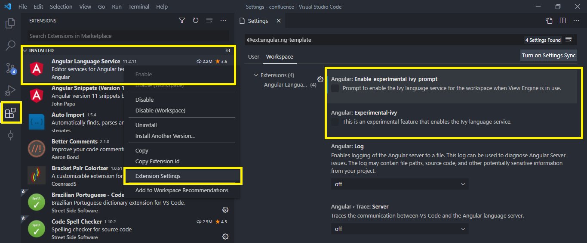

# Angular

For most projects, you'll need a proper framework to structure your code and reduce development time. VS Code supports most of the major ***frameworks*** through extensions. Here are some of the VS Code extensions that offer significant functionality.

## [Angular Language Service](https://marketplace.visualstudio.com/items?itemName=Angular.ng-template)

**License:** MIT

This extension provides a rich editing experience for Angular, both internal and external templates, including:

- Completion lists
- ***AOT*** diagnostic messages
- Quick information
- Go to the definition

> **Angular Ivy**
> The new Ivy compiler is available starting with Angular version 9.
> To prevent the extension from being incompatible in projects below **version 9**, we suggest disabling the ***Ivy*** compiler option, as shown in the example below:

