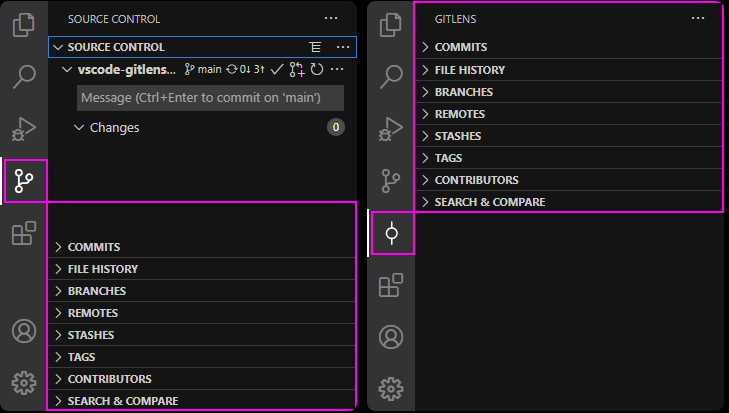

# Git

Leveraging the power of Git within VS Code can make your workflow more efficient and increase your productivity. Thanks to the source control integration functionalities done directly within the editor.

## [GitLens - Git supercharged](https://marketplace.visualstudio.com/items?itemName=eamodio.gitlens)

**License:** MIT

Extend the capabilities of Git integrated into Visual Studio Code - view code authorship at a glance via assignee annotations in Git and code lenses.

Seamlessly browse and explore Git repositories, gain valuable insights through powerful comparison commands, and more.

**Usage Example:**

