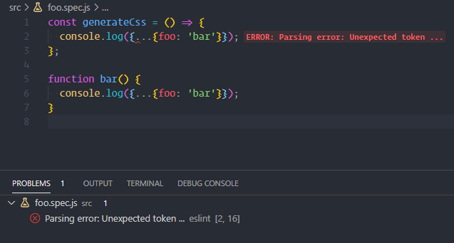
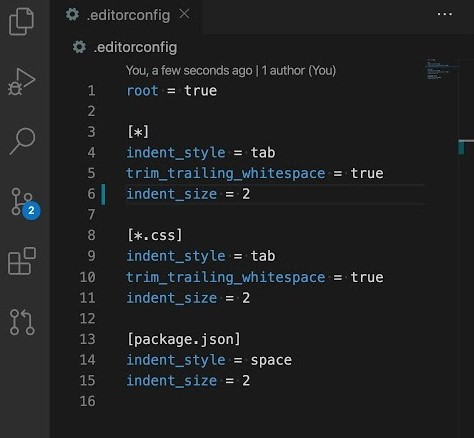

# ***Linter***

It's quite common for programmers to forget which coding style they agreed to work with. To enforce the rules, we need to use linters who compare your code to the rules you've established.

You define your rules by choosing a popular coding style, such as [**Standard**](https://standardjs.com/rules-en.html), [**Google**](https://google.github.io/styleguide/jsguide.html), and [**Airbnb**](https://github.com/airbnb/javascript).

You can use them as-is or use a configuration file to customize the rules.

VS Code doesn't have a built-in ***linter*JavaScript*** so you'll need to install an extension.

## [ESLint](https://marketplace.visualstudio.com/items?itemName=dbaeumer.vscode-eslint)

**License:** MIT

This is the most popular extension that provides support for the [**ESLint**](https://eslint.org/) library. For the extension to work, your project will need packages and ***plugins*** [**ESLint**](https://eslint.org/) installed.

You'll also need to create a ***.eslintrc***, which will specify the rules that the extension will use to parse your code.

**Usage Example:**

## [EditorConfig](https://marketplace.visualstudio.com/items?itemName=EditorConfig.EditorConfig)

**License:** MIT

This extension adjusts the settings you want to be defaulted to for all developers, and those settings will be applied to all editors, who have the plugin, installed only.

**Supported Properties:**

- ***indent_style***
- ***indent_size***
- ***tab_width***
- ***end_of_line*** (on save)
- ***insert_final_newline*** (on save)
- ***trim_trailing_whitespace*** (on save)

**Usage Example:**

