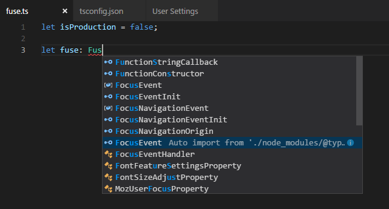
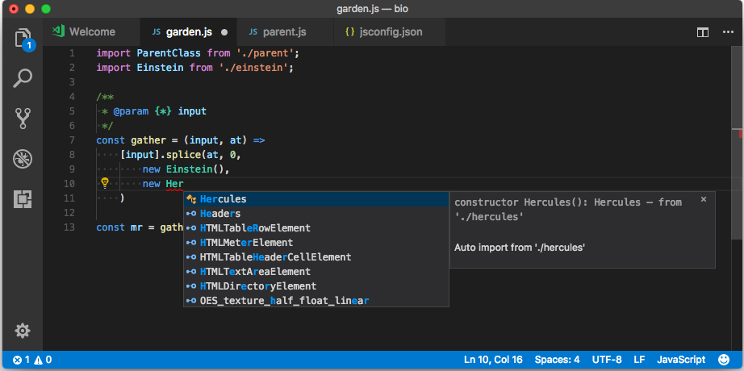

# Productivity

This group of extensions does some amazing tasks and makes it easy to write code and make the editor with custom settings.

## [Paste as JSON](https://marketplace.visualstudio.com/items?itemName=quicktype.quicktype)

**License:** MIT

Allows you to quickly convert ***JSON*** data into code.

It supports ***TypeScript***, ***Python***, ***Go***, ***Ruby***, ***C#***, ***Java***, ***Swift***, ***Rust***, ***Kotlin***, ***C++***, ***Flow***, ***Objective-C***, ***JavaScript***, ***Elm***, and ***JSON Schema***.

## [Code Spell Checker](https://marketplace.visualstudio.com/items?itemName=streetsidesoftware.code-spell-checker)

**License:** MIT

A basic spell checker that works well with the ***camelCase*** code. The purpose of this spell checker is to help detect common spelling errors while keeping the number of false positives low.

**Important: Install the broker for Brazil Portuguese**: [Brazilian English - Code Spell Checker](https://marketplace.visualstudio.com/items?itemName=streetsidesoftware.code-spell-checker-portuguese-brazilian)

## [CSS Peek](https://marketplace.visualstudio.com/items?itemName=pranaygp.vscode-css-peek)

**License:** MIT

This extension allows you to display the **ID** name of the **classes** ***CSS***, and go straight to the definition of the file where the ***CSS*** code is.

## [Auto Import](https://marketplace.visualstudio.com/items?itemName=steoates.autoimport)

**License:** MIT

This extension automatically finds, parses, and provides code actions, and autocompletes code for all available imports. Works with ***Typescript*** and ***TSX***.

**Usage Example:**

