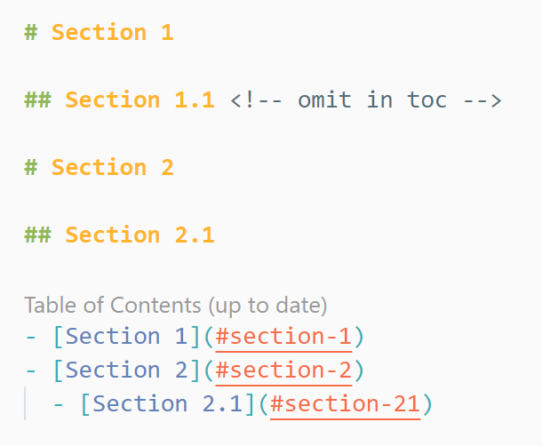

# Snippets

Snippets help you write repetitive code quickly.

## [JavaScript (ES6) code snippets](https://marketplace.visualstudio.com/items?itemName=xabikos.JavaScriptSnippets)

**License:** MIT

This extension provides ***ES6*** syntax for ***JavaScript***. All snippets include a trailing semicolon and have a list of snippets available to make it easier to write code.

**Supported languages (file extensions):**

- ***JavaScript*** (***.js***)
- ***TypeScript*** (***.ts***)
- ***JavaScript React*** (***.jsx***)
- ***TypeScript React*** (***.tsx***)
- ***Html*** (***.html***)
- ***Vu***e (***.vue***)

**Examples of Use:**

**Import & Export:**

| ***Trigger*** | Content |
| ------- | ------------------------------------------------------------------ |
| imp→ | Import FS from 'FS' |
| imn→ | Import the entire module without the module name 'import 'animate.css' |

**Class Aids:**

| ***Trigger*** | Content |
| ------- | ----------------------------------------------------- |
| con→ | Add default class constructor 'constructor() {}' |
| met→ | Creates the method in class 'add() {}' |

**Multiple methods:**

| ***Trigger*** | Content |
| ------- | ------------------------------------------------------------ |
| ***fre→*** | loop forEach in ***ES6*** syntax 'array.forEach(currentItem => {})' |
| ***for→*** | Loop... of 'for(const item of object) {}' |

**Console Methods:**

| ***Trigger*** | Content |
| ------- | -------------------------------------------------------------- |
| ***cas→*** | Console Alert Method 'Console.assert(Expression, Object)' |
| ***ccl→*** | console clear 'console.clear()'|

## [Auto Rename Tag](https://marketplace.visualstudio.com/items?itemName=formulahendry.auto-rename-tag)

**License:** MIT

Automatically rename the related ***tag*** ***HTML***.

## [Markdown All in One](https://marketplace.visualstudio.com/items?itemName=yzhang.markdown-all-in-one)

**License:** MIT

This one-of-a-kind extension assists with many of your needs with creating markdowns, such as auto-preview, shortcuts, auto-fill, etc.

**Usage Example:**

