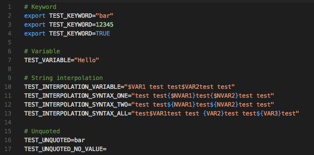

# Syntax Highlighting

Syntax highlighting extensions are quite useful when it comes to certain types of projects and file extensions.

## [DotENV](https://marketplace.visualstudio.com/items?itemName=mikestead.dotenv)

**License:** MIT

This extension provides syntax highlighting support for environment settings for **.env** files.

**Usage Example:**

## [Color Pick](https://marketplace.visualstudio.com/items?itemName=anseki.vscode-color)

**License:** MIT

This extension displays the colors and has an interface to edit the color directly in the code.
