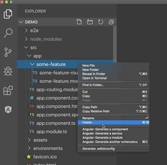
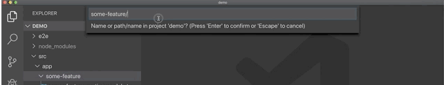
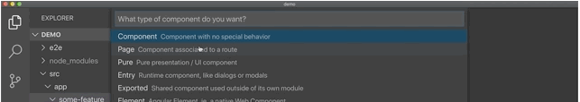
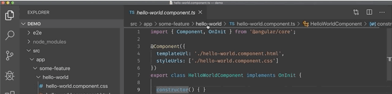

# Angular

For most projects, you'll need a proper framework to structure your code and reduce development time. VS Code supports most of the major ***frameworks*** through extensions. Here are some of the VS Code extensions that offer significant functionality.

## [Angular 10 Snippets - TypeScript, Html, Angular Material, ngRx, RxJS & Flex Layout](https://marketplace.visualstudio.com/items?itemName=Mikael.Angular-BeastCode)

**License:** MIT

It has ***snippets*** for ***Angular*** 2, 4, 5, 6, 7, 8, 9 and 10. Supports ***Typescript***, ***HTML***, ***Angular Material ngRx***, ***RxJS***, ***PWA*** and ***Flex Layout***.

## [Angular Schematics](https://marketplace.visualstudio.com/items?itemName=cyrilletuzi.angular-schematics)

**License:** MIT

This extension makes Angular schematics (CLI commands) available through the Explorer, Command Palette. This extension promotes Angular best practices by improving component generation by suggesting different types of components.

**Usage Example:**

