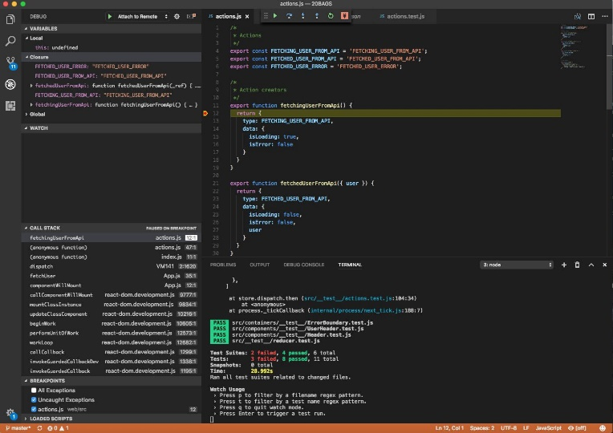
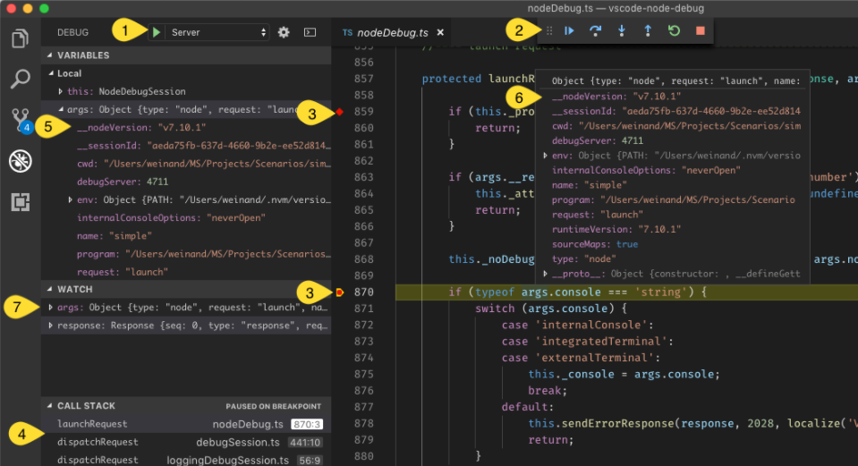
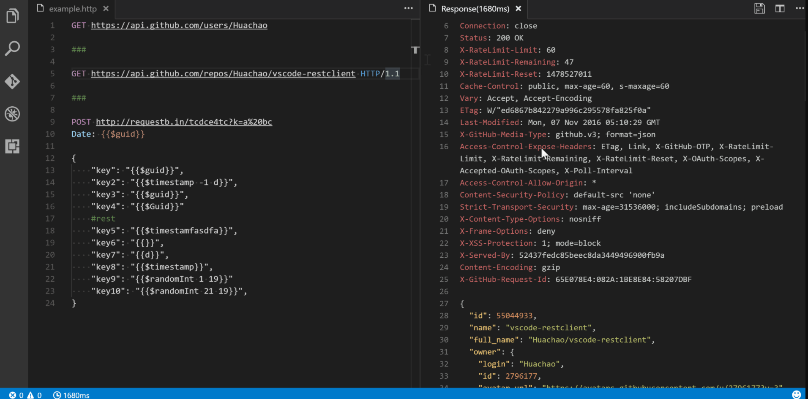

# Browser

Unless you're writing a console program in JavaScript, you'll probably run your JavaScript code inside a browser. This means that you'll need to refresh the page frequently to see the effect of each code update you make.

Instead of doing it manually all the time, here are some tools that can significantly reduce the development time of your iteration process.

## [Debugger for Chrome](https://marketplace.visualstudio.com/items?itemName=msjsdiag.debugger-for-chrome)

**License:** MIT

This extension allows you to debug your JavaScript code in Chrome or any other destination that supports the Chrome Debugging Protocol. If you're new to this extension and debugging VS Code.

Check out the [Debugging JavaScript Projects with VS Code and Chrome Debugger] tutorial(<https://www.sitepoint.com/debugging-javascript-projects-vs-code-chrome-debugger/>).

## [Debugger for Firefox](https://marketplace.visualstudio.com/items?itemName=firefox-devtools.vscode-firefox-debug)

**License:** MIT

This extension allows you to debug your JavaScript code in Firefox.

**License:** MIT

This extension allows you to debug your JavaScript code in Microsoft Edge.

## [Live Server](https://marketplace.visualstudio.com/items?itemName=ritwickdey.LiveServer)

**License:** MIT

This extension allows you to launch a local development server with live reload capability for both static and dynamic pages.

## [Rest Client](https://marketplace.visualstudio.com/items?itemName=ritwickdey.LiveServer)

**License:** MIT

Instead of using a browser or a CURL program to test the APIs, you can install this tool to run HTTP requests interactively within the editor.

**Usage Example:**

