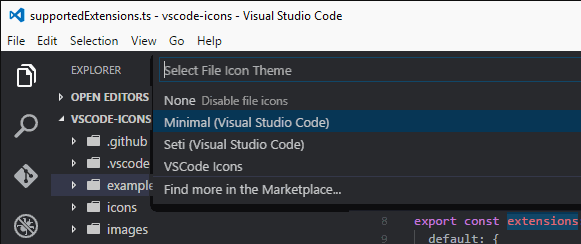
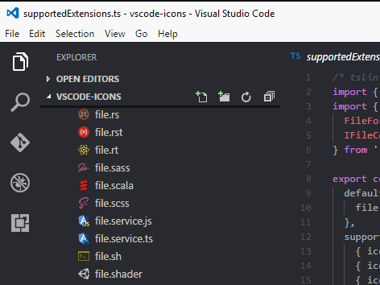
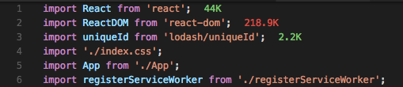
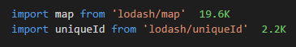
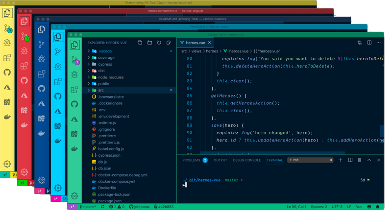
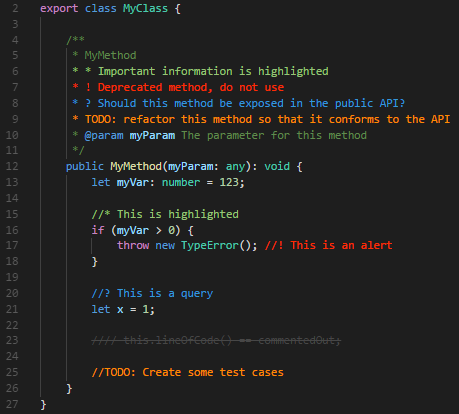
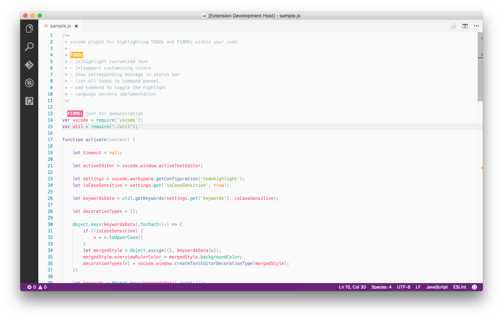
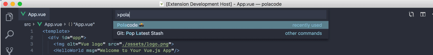
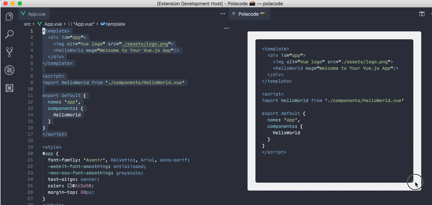

# Productivity

This group of extensions does some amazing tasks and makes it easy to write code and make the editor with custom settings.

## [vscode-icons](https://marketplace.visualstudio.com/items?itemName=vscode-icons-team.vscode-icons)

**License:** MIT

This extension adds colors and icons that make it easier to identify file extensions.

**Usage Example:**

## [Web Accessibility](https://marketplace.visualstudio.com/items?itemName=MaxvanderSchee.web-accessibility)

**License:** MIT

**I heard you wanted to write more accessible code? Well, you've come to the right extent!**

This extension is here to help you get feedback on which parts need a little more attention so they're accessible; This is just the basics and doesn't cover all the rules, but it will help make your project more accessible.

## [Import Cost](https://marketplace.visualstudio.com/items?itemName=wix.vscode-import-cost)

**License:** MIT

This extension will display the size of the imported package in the editor.

**Usage Example:**

## [Peacock](https://marketplace.visualstudio.com/items?itemName=johnpapa.vscode-peacock)

**License:** MIT

This extension allows you to change the color of the Visual Studio Code environment, so you can quickly identify which instance you just switched to.

**Usage Example:**

## [Better Comments](https://marketplace.visualstudio.com/items?itemName=aaron-bond.better-comments)

**License:** MIT

This extension will help you create friendlier comments in your code. With this extension, you'll be able to categorize your notes.

**Usage Example:**

## [TODO Highlight](https://marketplace.visualstudio.com/items?itemName=wayou.vscode-todo-highlight)

**License:** MIT

This extension highlights and reminds you that there are notes or things that haven't been done yet in the code.

**Usage Example:**

## [Polacode](https://marketplace.visualstudio.com/items?itemName=pnp.polacode)

**License:** MIT

This extension is a great way to capture your code. Very useful when writing tutorials.

**Usage Example:**

