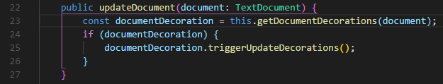
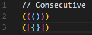
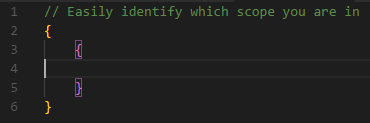
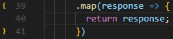

# ***Syntax Highlight***

Syntax highlight extensions are quite useful when it comes to certain types of projects and file extensions.

## [Bracket Pair Colorizer 2](https://marketplace.visualstudio.com/items?itemName=CoenraadS.bracket-pair-colorizer-2)

**License:** MIT

This extension highlights matching brackets with different colors, helping you identify which bracket belongs to which block.

**Usage Example:**

