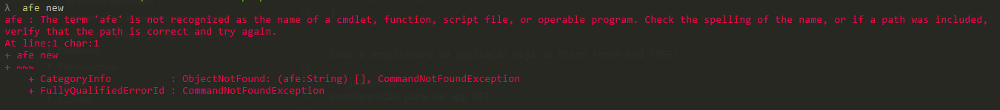

# How to solve the error "The term 'afe' is not recognized"?

## Contextualization

The ***The term 'afe' is not recognized*** error appears when trying to run the `afe` command.

## Solution

To resolve the issue, you need to do the following:

- In the Windows search bar, search for "Environment Variables for your account";
- In the ***PATH*** variable, add '%AppData%\npm';
- Restart the machine;

This way the error will be corrected and the 'afe' command will work correctly.

> **⚠️ Note**
>
> If the error persists, contact the Help Desk to validate your permissions.
