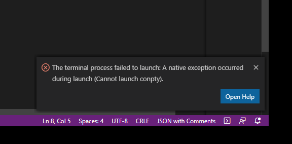
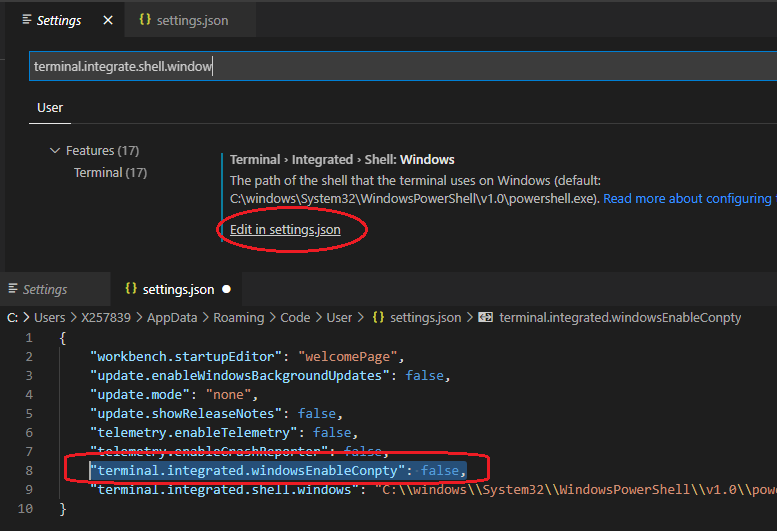

# How To Troubleshoot Error Running vscode Terminal?

## Contextualization

When running the VsCode terminal, you may encounter the error:



## Solution

The problem can be resolved by adding the following line to the ***settings.json***

```json
"terminal.integrated.windowsEnable": false,
```


