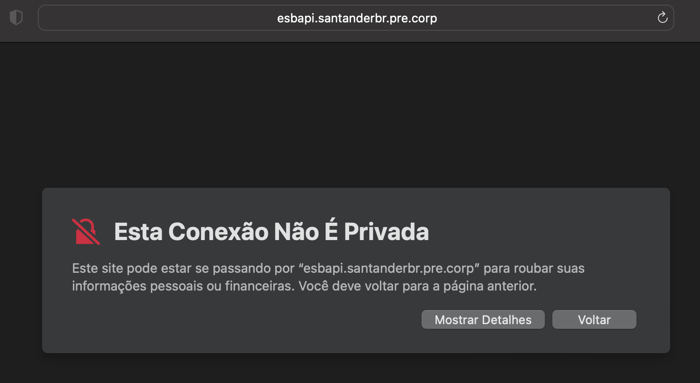

# How to Troubleshoot Invalid Certificate or "Your Connection Is Not Private"

## Contextualization

When trying to access any of the bank's internal tools or services through the browser (Chrome, Safari, Edge, etc.), you may come across the error "Your connection is not private" or "Your connection is not secure", as in the image below:

This is because the browser does not recognize the site's self-signed security certificate as valid

In some cases, even a valid certificate is not recognized by other browsers (e.g. Safari for macOS environments)

> If the certificate has expired and is really not valid, it is ideal to look for the Tech Services area to seek guidance on how to proceed

## Solution

### Mac OS

- Go to the tool or service that accuses invalid certificate in your browser, click Show more details, and then view certificate. Click and hold the certificate icon and drag it to the Finder.

- With the **Finder** open, double-click on the downloaded certificate, this will cause the certificate to be saved in the **Keychain Access** or **Keychain Access** tool

- Double-click the certificate in the **Keychain Access** tool, then expand the **Trust** option, and in the **When using this certificate** field.
- Select the **Always Trust** option. Next, close the certificate configuration window, which will prompt you to enter your password to confirm the changes

- Try to access the tool or service again in the browser and it should already be accessible

## Architecture Guidelines

The front-end architecture (AFE) **does not guide** only click on **Show more details** and then on **Visit this site**, because in other accesses later they will cause the same error.
