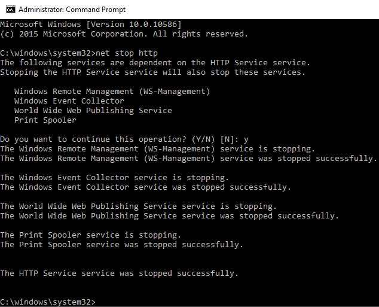

# How to terminate the port 80 process in Windows?

## Solution

To kill port 80 in Windows, you need to open CMD and first locate the process that is using that port. To do this, run the command:

```bash
netstat -nao | find ":80"

net stop http
```



A list will be returned with all the processes that meet the ***find***.

Locate the exact process that uses port 80 and in the last column of the list, note the ***PID*** (number of the running process) With the ***PID*** number in hand, run the command below, changing it to the ***PID*** found:

```bash
taskkill /PID numerodoPID /F
```
