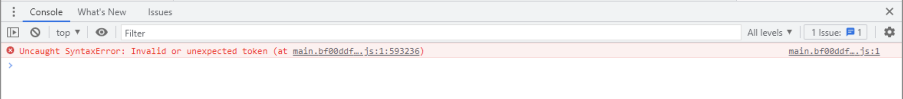
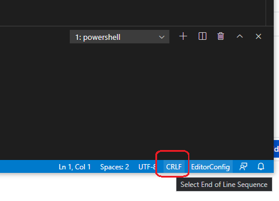

# How to solve "Invalid or unexpected token" or "unexpected EOF"



## Contextualization

An error may occur in the construction of the ***bundle*** of the application due to problems in the ***replace.tokens*** file.

One of them being the formatting of the file's line break, generating the error **"Invalid or unexpected token"** or **"unexpected EOF** in the browser console.

## Solution

To solve the problem, you need to open ***.editorconfig*** and add the following command:

```bash
[*.tokens]
end_of_line = lf
```

After that, create a file in the root of the project called ***.gitattributes*** and add the following command:

```bash
* text eol=lf
```

Once this is done, open the ***replace.tokens*** file and change the setting from ***CRLF*** to ***LF***, at the location indicated in the following ***print*** below:


