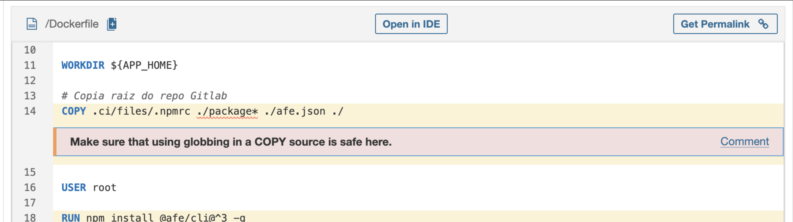

# How to solve the note "Make sure that the copy is safe"

## Contextualization

During the execution of the "**Code Static Analysis**" step in the DevOps treadmill, your project may run into a problem in the Sonar Qube step, pertinent to copying files securely.



This note concerns how a directory is copied.

Take a look at the following example:

```bash
COPY .ci/files/.npmrc ./package* ./afe.json ./
```

In this ***Dockerfile***statement, we use the asterisk to copy all files that start with ***./package***, so the ***package-lock.json*** and ***package.json*** files will be copied to the container.

Such a practice could induce a vulnerability, as an attacker could create a file named ***./package.exe*** and insert malicious code that will be copied into the container.

The best way to make our application more secure is to explicitly define the files you want to copy:

```bash
COPY .ci/files/.npmrc ./package.json ./package-lock.json ./afe.json ./
```

## Architecture Guidelines

Parse the file statement and copy directories non-recursively, that is, copying only the files that you explicitly want. In this way, we will be putting only the mapped files into the container.
