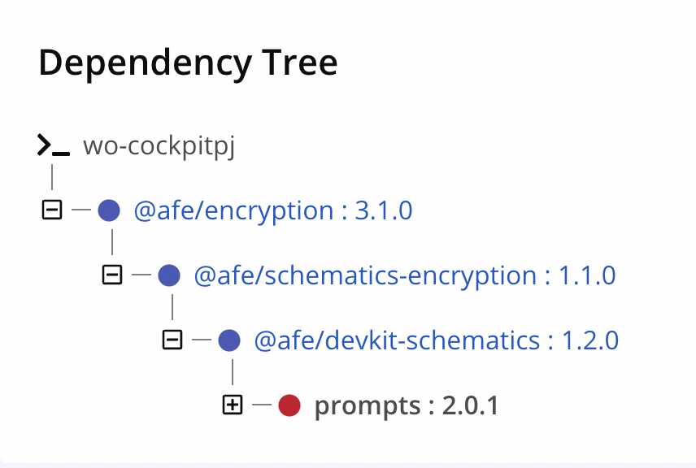

# How to Troubleshoot Transitive AFE Dependencies

Some projects may break in the pipeline due to the analysis that IQ Server performs when analyzing the dependencies used by the AFE libraries.



## Contextualization

The structuring parts of the Front End Architecture use a dependency called ***@afe/devkit-schematics***, which uses the ***prompts***. Version **1.2.0** has vulnerabilities that have already been fixed in version **1.2.1**.

Sometimes, in ***package-lock.json*** the versions of the ***peerDependencies*** used get stuck, causing IQ Server to not detect the version change, pointing out the vulnerability.

```json
"@afe/devkit-schematics": {
  "version": "1.2.0",
  "resolved":
  "integrity": ,
  "requires": {
    "glob": "^7.1.2",
    "prompts": "^2.4.2"
  }
},
```

## Solution

Follow the guidance in the [Corrected Versions of AFE Components](https://afe.paas.santanderbr.pre.corp/docs/news/relatorios/analise-dependencias-afe/correcoes-dependencias) guide to troubleshoot your issue.
