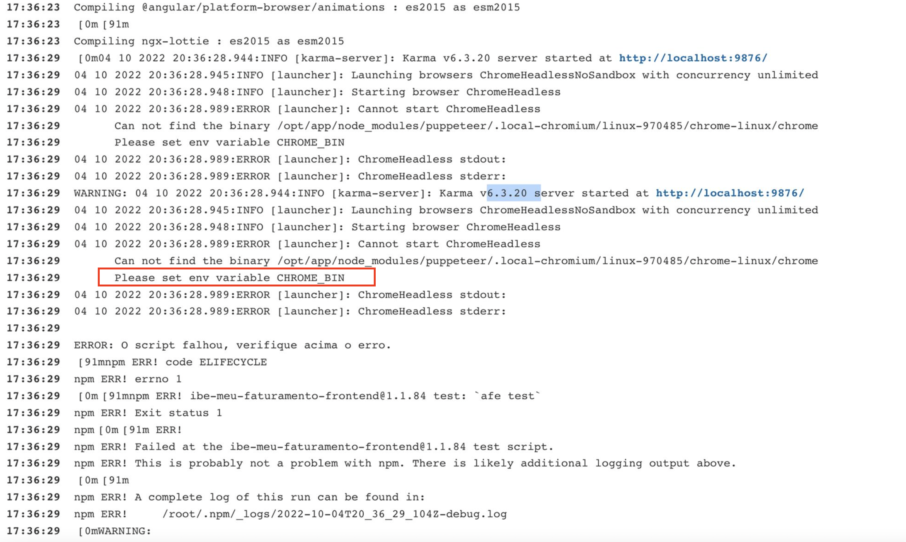

# How to solve the "Please set env variable CHROME_BIN" problem

While running the Angular treadmill, we may come across the following error:



## Contextualization

During local development, unit tests are run in the browser available on the user's machine.

However, during the execution of the treadmill we don't have the same environment and because of this, we currently use [Puppeteer](https://developer.chrome.com/docs/puppeteer/) as an execution *engine* when we can't use conventional browsers.

When Puppeteer is not installed or configured correctly, the ***Please set env variable CHROME_BIN*** error may appear.

## Solution

To solve this problem, we must make sure that the treadmill's ***.npmrc*** configuration files have the correct path from where to find the ***puppeteer***. It can be found at the root of the repository and inside the ***./ci/files*** folder.

Make sure that the ***./ci/files/.npmrc*** file has the ***puppeteer_download_host*** variable that is the same as defined below and that the ***puppeteer_chromium_revision*** variable does not exist.

```diff
+ puppeteer_download_host=http://artifactory.santanderbr.corp/artifactory/github-puppeteer/
- puppeteer_chromium_revision=543305
```

> This way, the treadmill will always look for the most up-to-date version of ***puppeteer***.
