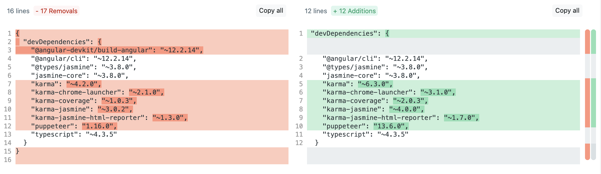

# How to Troubleshoot Chrome Headless Being Disconnected After a Certain Time

It is common for some developers to come across the following error during the execution of unit tests at the time of deploying the application in the environments:

```bash
Chrome Headless Disconnected (0 times), because no message in 180000 ms.

=============================== Coverage summary ===============================
Statements   : Unknown% ( 0/0 )
Branches     : Unknown% ( 0/0 )
Functions    : Unknown% ( 0/0 )
Lines        : Unknown% ( 0/0 )
```

## Contextualization

This category of problem most often occurs on the treadmill and is related to the versions of **karma**, **puppeteer**, and **jasmine** defined in ***package.json***.

The following ***warning*** may also reflect the source of the error:

```bash
[log4js-node-DEP0004] DeprecationWarning: Pattern %d{DATE} is deprecated due to the confusion it causes when used. Please use %d{DATETIME} instead.
```

In this scenario, ***karma*** itself has made a fix available from version **^6.3.12**, which removes the ***warning*** of deprecation. In some cases, this measure also fixes the issue of **Chrome Headless Disconnected** in some cases.

> **⚠️ Warning!**
>
> When we update any dependency used to run unit tests, we must make sure that we equalize all other packages (***karma-***\*, **jasmine-**\*) so that there is no conflict between more updated and less updated versions.

## Architecture Guidelines

To solve the problem, you should **update the versions** of the mentioned packages to the most appropriate ones, according to the Angular version of the project.

To validate that your project is using the correct versions, generate a new application using the Angular CLI (or the architecture itself) on the same version of Angular used in the project and do a version comparison in ***package.json***

You can use the <https://www.diffchecker.com> tool to find packages with different versions.



> The **puppeteer** package is not added by default by Angular, as it is used on the conveyor belt to create a browser instance at the time of running tests, allowing them to run in Docker.
