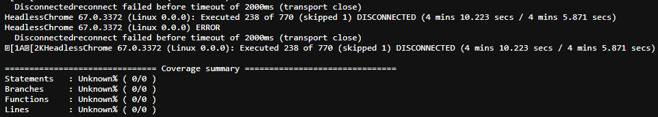

# Disconnectedreconnect failed before timeout



This error happens when unit tests fail to connect to the Karma server before the configured timeout.

The possible cause for this problem is the use of a very old version of the [Pupperteer](https://pptr.dev/) library.

## Solution

To resolve the issue, you need to update your version of Pupperteer.

In the application's 'package.json' file, update the library version to a newer one.

```diff
"devDependencies": {
-  "puppeteer": "1.2.0",
+  "puppeteer": "10.2.0",
}
```

Comment out the 'puppeteer_chromium_revision' variable in the root '.npmrc' file and also in the project's '.ci/files' folder.

```diff
- puppeteer_chromium_revision=123456
+ # puppeteer_chromium_revision=123456
```

```diff
- puppeteer_chromium_revision=123456
+ # puppeteer_chromium_revision=123456
```

Install the project dependencies so that the changes are mapped by the npm.

Run the command below in your terminal.

```bash
npm install
```

After you make these changes, run the tests again on the pipeline.
