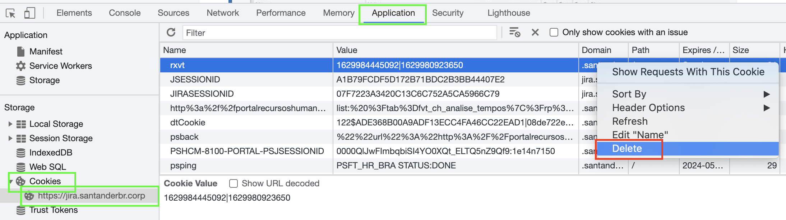

# **Cookies** exceeding request size limit for ***Apigee***

> **❗ Information**
>
> This documentation originated from the resolution of the call [AFE-966](https://jira.santanderbr.corp/browse/AFE-966)

## Contextualization

The ***400 bad request*** error may be the size of the ***cookies*** that your own project generates or makes use of that may be exceeding the **size limit** of the request for ***apigee***.

## Solution

In this case, a quick test would be to delete the cookies, using the following steps:

- Open the developer tool (***Ctrl*** + ***F12*** or **left mouse button** -> **Inspect**);
- Navigate to the **Application** tab;
- In the left menu, go to the **Cookies** section;
- Select the domain of your application;
- Next to it will open all ***cookies*** stored by the application.
- Select the ***cookie*** with the largest size and click the **left mouse button** -> **Delete**

And finally, make a new request to the **API**.
