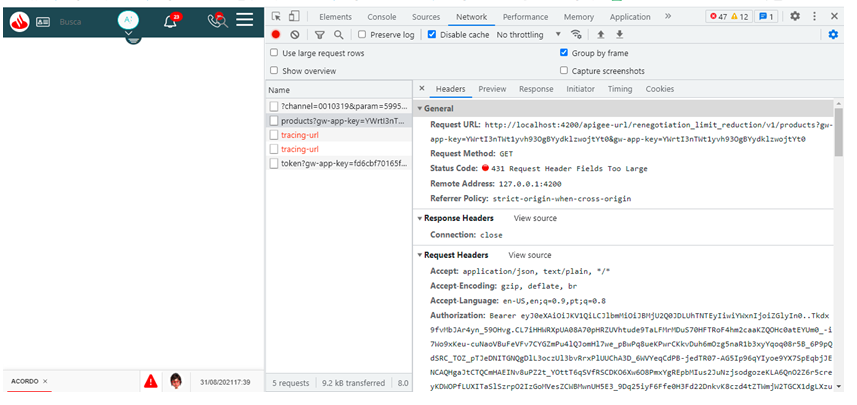

# How to solve ***431 Request Header Fields Too Large*** in the coexistence between ***Zup*** and ***Apigee***

## Contextualization

The HTTP response status code ***431 Request Header Fields Too Large*** indicates that the server refused to process the request because the HTTP ***Headers*** of the request are too large.

> **❗ Information**
>
> This documentation originated from the resolution of the call [AFE-1062](https://jira.santanderbr.corp/browse/AFE-1062)

## Solution

If you are getting the ***431 Request Header Fields Too Large*** error in resource calls in ***Apigee*** you should analyze the size of the ***Headers*** together with the [integration architecture](https://confluence.santanderbr.corp/pages/viewpage.action?pageId=225764440).
