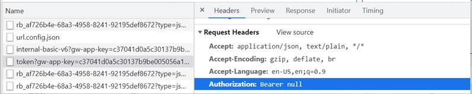

# How to Troubleshoot Authentication Token Returning Null Error

## Contextualization

During ***login*** to ***Zup***, it may be that the request to authenticate is sending the ***header*** **Authorization** as null, as shown in the following image:

This is because the ***@afe/http-interceptors*** architecture piece needs the **Access-Control-Expose-Headers** header to expose the ***x-apigee-access-token***, which is returned right after the application authenticates to ***zup***.

## Solution

To solve the problem, you must [open a ticket to the CDG](https://jira.santanderbr.corp/projects/SCDGHUBBR/), requesting the configuration of the ***x-apigee-access-token*** in the ***header*** **Access-Control-Expose-Headers**.
