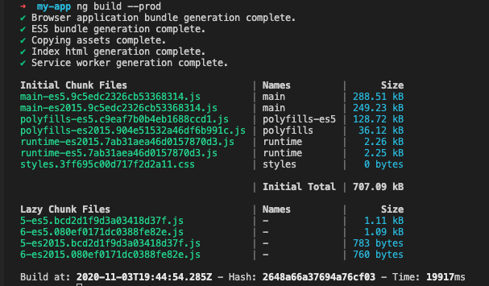
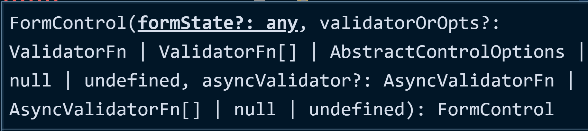
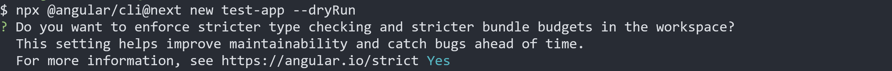
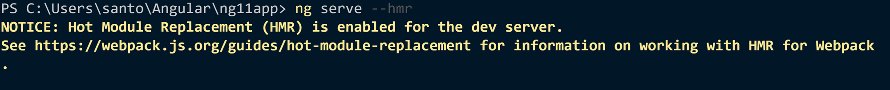
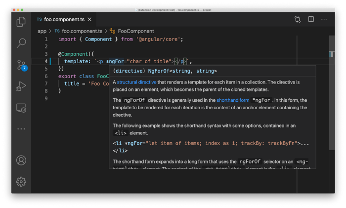

# News on Angular 11

## Visual CLI / Logs

One of the first changes we'll notice when updating the app to version 11 will be more intuitive logging.

The CLI now more clearly presents compiled files and their sizes using a table, making it easier to compare sizes between them. In addition, there has been an overall improvement in the look and feel of the cli.



## Up to 4x faster builds

Angular 11 brought a big performance improvement to the build. Much of this was due to the improved performance of ***NGCC (Angular Compatibility Compiler)*** which in some cases brought a compilation speed 4 times faster.

Another point that improved the build time was precisely the update to ***TypeScript 4.0***.

### TypeScript 4.0

With this latest update, the Angular team has dropped support for TypeScript 3.9, with only support for TypeScript 4.0. One of the main reasons behind this update is to speed up builds.

Angular 11 guarantees much faster builds than previous versions.

### Webpack 5

Webpack is used to compile a large number of files into a single package or file. Webpack 5 is the latest version, but it's not fully stable yet.

However, Angular 11 provides experimental support for Webpack 5, and you can use it to try new things.

According to the release notes, the Angular team believes it can extend this experimental support to get faster builds and small packages once things get stable.

> Support is experimental and under development, so it is not recommended to enable for production uses. you can use webpack 5 with Angular 11, but there are 2 things you need to keep in mind:

- It can be used if you are using ***yarn***
- The ***webpack 5*** is still experimental, so it's not suggested to use it in production

To use the ***webpack 5*** add the following code in ***package.json*** file

```ts
"resolutions": {
  "webpack": "5.4.0"
}
```

> You'll need to use yarn to test this, as npm doesn't yet support the resolutions property.

## TSLint Depreciation

In previous versions of Angular, we had the default implementation for linting ***TSLint*** . Now, it has been deprecated by the project's creators who recommend migrating to ***ESLint***.

## Removing support from IE versions

In this update, support for IE9 / IE10 and IE mobile has been removed, making Internet Explorer 11 the only version still compatible with Angular.

## Automatic Font Import

Angular now automatically downloads the fonts used in the project and adds them to the build files.

> This functionality will only take effect in ***build*** for productive environment, using the 'ng build --prod' command.

## Forms

Added ***types*** for ***validators*** and ***asyncValidators*** that were previously used as ***any***.



## CLI Features

### Generator for Resolvers

You can now generate a resolve guard using the CLI, using the command below to do the same:

```bash
ng g r/resolver <name>
```

### Feature to extract i18n tokens from the library

Starting with Angular 11, you can also extract the i18n tokens from the Angular libraries using the command below:

```bash
ng xi18n --ivy
```

### Prompt for Strict Mode

Angular 10 had a `--strict` flag to generate angular applications with all ***strict*** checks enabled, now you will get a ***prompt*** to check if you want to enable it as in the image below.



#### Hot Module Replacement (HMR)

Previously only available with ***webpack***, it is now possible to enable ***HMR*** directly through the ***CLI*** of ***Angular***, using the command:

```ts
 ng serve --hmr
```

The interesting thing about ***Hot Module Replacement (HMR)*** is the fact that it is not necessary to update the entire screen when a change is made to a module/component.

After the local server starts, the console displays a message confirming that ***HMR*** is active:


> See [Hot Module Replacement](https://webpack.js.org/guides/hot-module-replacement) for information on working with ***HMR*** in ***webpack***.

### ***Angular Language Service***

Previously based on the ***View Engine***, the service is now based on the ***Ivy*** engine providing a more powerful and accurate experience for developers.

Language services will be able to correctly display generic types in templates in the same way that the ***TypeScript*** compiler does. For example, in the screenshot below, we can see that the iterable is of type ***string***.


