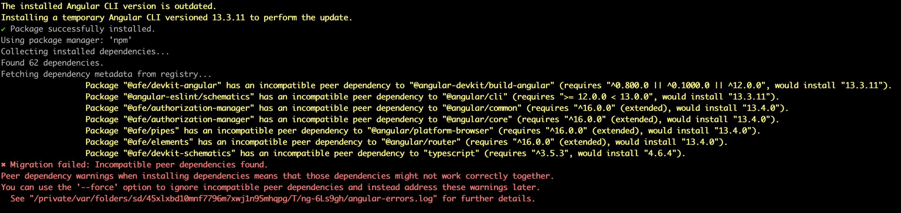

# How to update the architecture structures

During the phased migration process, you may encounter incompatibilities in the ***peer dependencies*** on the **AFE** parts.

This is normal and expected, as the **AFE** parts were migrated from version 12 to 16, and are not compatible with versions 13, 14 and 15 of Angular.

## Dealing with peer dependency incompatibilities



When you encounter ***peer dependencies*** incompatibilities, you should use the **--force** option to force installation of the dependencies.

```bash

npx @angular/cli@13 update @angular/core@13 @angular/cli@13 --force

```

This forces the installation of dependencies even if they are not compatible with the version of Angular you are upgrading and the migration should proceed normally.
