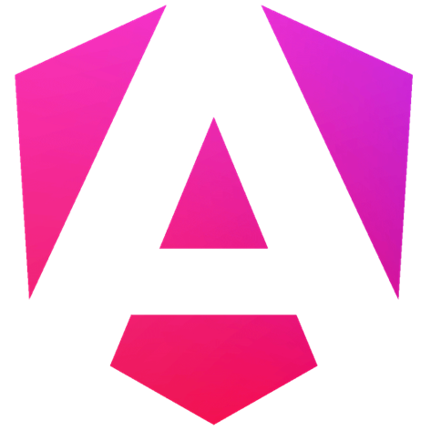
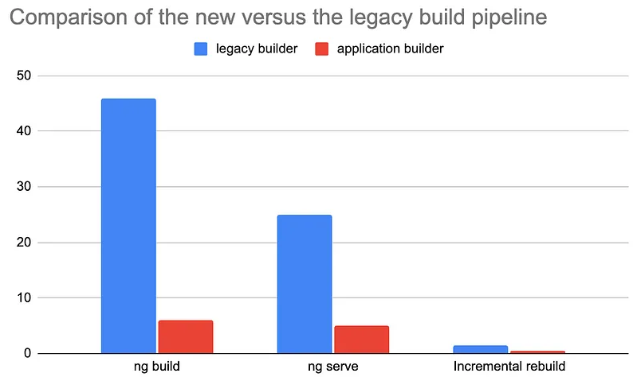

# What's new in Angular 17

- [What's new in Angular 17](#whats-new-in-angular-17)
  - [New visual identity](#new-visual-identity)
  - [New website](#new-website)
  - [Control Flow Analysis](#control-flow-analysis)
    - [if](#if)
    - [for](#for)
    - [switch](#switch)
  - Deprecations Views
  - [Signals is stable](#signals-is-stable)
  - [Vite and ESbuild are the default bundles](#vite-and-esbuild-are-the-default-bundles)
  - [Styles and style URLs as strings](#styles-and-style-urls-as-strings)
  - [Experimental support for view transitions](#experimental-support-for-view-transitions)
  - [Standalone API is now the standard](#standalone-api-is-now-the-standard)

## New visual identity

Angular has created a logo to represent its constant evolution in the latest releases.



## New website

A new website has been created to reflect the framework's new visual identity and also to improve usability when consulting the documentation.

Visit the website at [angular.dev](https://angular.dev)

## Control Flow Analysis

This new syntax replaces the well-known structural directives in Angular, allowing for a better development experience and also a significant improvement in component performance.

Control Flow Syntax is provided by default in the framework and is interpreted directly by the Angular compiler. Therefore, you don't need to import anything into your components.

### @if

To implement simple conditions, you can use the new `@if`, `@else if`, and `@else` operators.

See below an example of how to use:

```ts title='component.html'
@if (loggedIn) {
  The user is logged in
} @else {
  The user is not logged in
}
```

See more details in the [official Angular documentation on the @if operator](https://v17.angular.io/guide/control_flow#if-block-conditionals).

### @for

Rendering list items has become much simpler with the new `@for` operator.

See below how to use:

```ts title='component.html'
@for (user of users; track user.id) {
  {{ user.name }}
} @empty {
  Empty list of users
}
```

See more details in the [official Angular documentation on the @for operator](https://v17.angular.io/guide/control_flow#for-block---repeaters).

### @switch

If you need to render a specific value based on the value of a property, it might be useful to use the new `@switch` operator (an alternative to `@if`).

See below how to use:

```ts title='component.html'
@switch (accessLevel) {
  @case ('admin') { <admin-dashboard/> }
  @case ('moderator') { <moderator-dashboard/> }
  @default { <user-dashboard/> }
}
```

See more details in the [official Angular documentation on the @switch operator](https://v17.angular.io/guide/control_flow#switch-block---selection).

## Deprecations Views

This new feature allows components in the template to be loaded on demand, making the rendering more optimized and the final bundle lighter!

With the new @defer operator, you can configure how and when the loading should be done, allowing for a high level of customization.

```ts title='component.html'
@defer {
  <comment-list />
}
```

See more details in the [official Angular documentation on the @defer operator](https://v17.angular.io/guide/defer).

## Signals is stable

`Signals` is stable and can be safely used in production.

See more details in the [official Angular documentation on the Signals operator](https://v17.angular.io/guide/signals).

## Vite and ESbuild are the default bundles

Angular 17 now uses Vite and ESbuild as the default for building application bundles. This brings a significant improvement in development performance as well as application runtime performance.

See the chart below for a comparison between building an Angular application with [Webpack](https://webpack.js.org/) and [Vite](https://vitejs.dev/):



See more details in the [official Angular documentation on Vite and ESbuild](https://v17.angular.io/guide/esbuild)

## Styles and style URLs as strings

Angular components support multiple style sheets per component.

However, typically, when wanting to style components, an array with a single element is created pointing to inline styles or referencing an external style sheet.

A new feature allows for a change from:

```typescript title='component.ts'
@Component({
  styles: [`
    ...
  `]
})
...

@Component({
  styleUrls: ['styles.css']
})
...
```

To the simpler and more logical form:

```ts title='component.ts'
@Component({
  styles: `
    ...
  `
})
...

@Component({
  styleUrl: 'styles.css'
})
...
```

Support for multiple style sheets is still maintained when using an array. This is more ergonomic, more intuitive, and integrates better with automated formatting tools.

## Experimental support for view transitions

The View Transitions API allows for smooth transitions when changing the DOM.

In the Angular router, we now provide direct support for this API through the `withViewTransitions` feature.

Using this, you can leverage the browser's native capabilities to create animated transitions between routes.

You can add this feature to your application today by configuring it in the router provider declaration during initialization:

```typescript title='main.ts'
bootstrapApplication(AppComponent, {
  providers: [provideRouter(routes, withViewTransitions())],
});
```

## Standalone API is now the standard

The Standalone API is now used by default in application creation.
