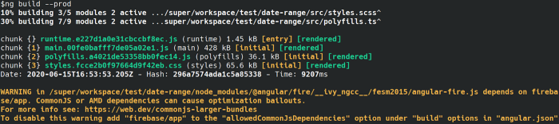

# What's new in Angular 10

## Angular Material Angular's user interfaces have had a major update in Angular Material, and now includes a new date range selector

- To use the new selector, simply use the `<mat-date-range-input>` and  components `<mat-date-range-picker>`.

### Import Notices from ***CommonJS***

Using a dependency bundled with CommonJS can result in larger and slower applications.

Angular now warns you when your build uses a package packaged with CommonJS.

## Stricter Optional Settings

Version 10 now offers a more restricted project configuration when creating a new workspace via the `ng new --strict` command.

Once this flag is enabled, it initializes the new project with new settings that improve maintainability, help detect bugs well in advance, and allow the CLI to perform advanced optimizations on the application.

Specifically, the flag does the following:

- Enables TypeScript strict mode.
- Change the ***template type check*** check to ***Strict***.
- By default, generated packets will be reduced by about 75%.
- Configures ***linting*** rules to avoid ***any***type declarations.
- Configure the application as side-effect-free to allow for more advanced tree-shaking.

> What is tree-shaking?
>
> Tree-shaking is a step in the build process where unused code is removed.

A compiler interface has been added, wrapping around the current compiler (***ngtsc***), so that the language-service-specific compiler manages multiple type-checked files using the project interface, creating ***ScriptInfos*** as needed.

Autocomplete has been removed from HTML entities such as ***&amp;*** (&amp;), ***&lt;*** (&lt;), etc, because it is outside of Angular's core functionality and has a questionable value and performance cost.

> [Angular Language Service](https://angular.io/guide/language-service) is an analysis engine that integrates with your code editor and provides a way to get conclusions, track references, errors, hints, and navigate within models Angular.

### Router

The ***CanLoad*** guard can now return a ****Urltree***. This callback cancels the current navigation and redirects.

This corresponds to the current behavior of the available CanActivate protections. In addition, any routes with a ***CanLoad*** protector will not be preloaded and guards will not be completed as part of the preload.

### Localization

Support for merging multiple documents for translation that could only be uploaded one file at a time in previous versions.

It is now possible to specify some documents according to locale, and translations of each of these documents can be merged via a message ID.
