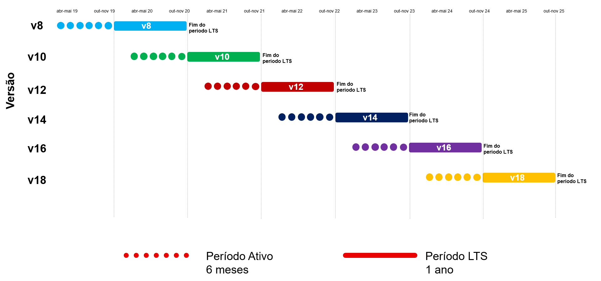
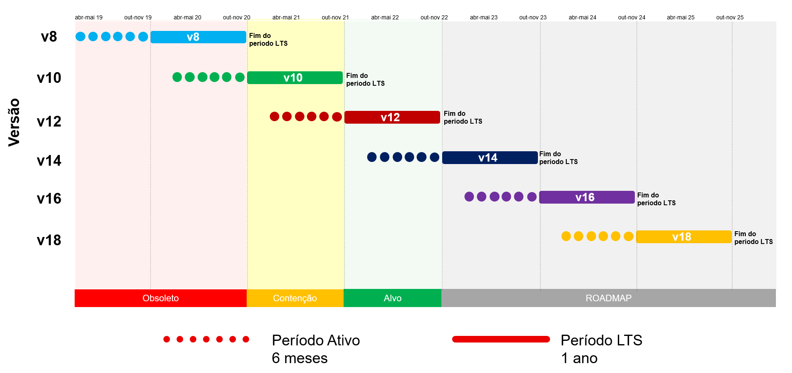
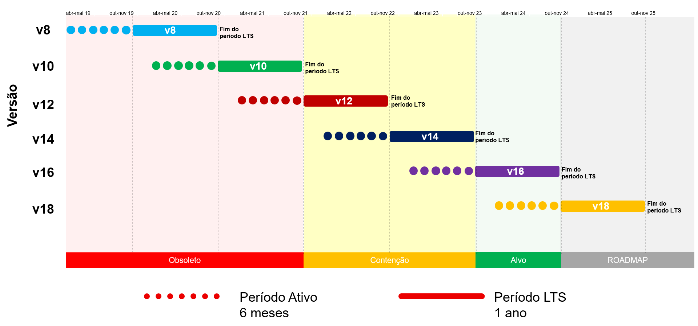
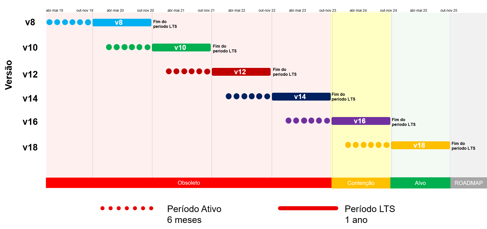

# Angular update cycle

Check out the Angular Update Cycle based on the graphs below, exploring the perspectives of past, present, future times and an overview.

Angular Obsolescence - Overview

Angular Obsolescence - Vision 2023

Angular Obsolescence - Vision 2024

Angular Obsolescence - Vision 2025

