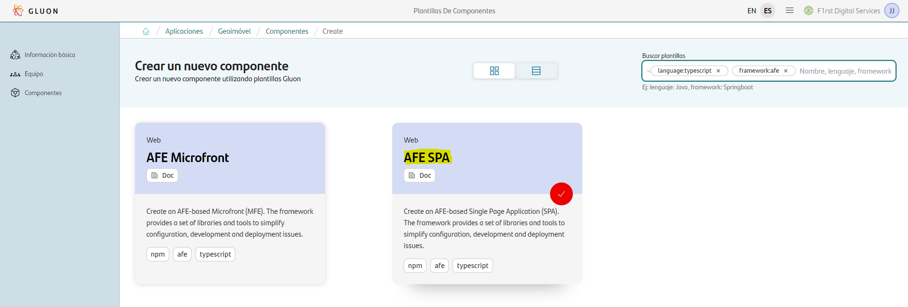
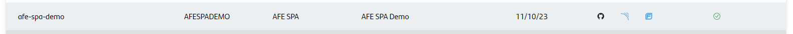

## Introduction

The purpose of this documentation is to provide a **step-by-step guide** on how to create, build, analyze and deploy an SPA based on  **AFE** framework within the GLUON platform.

This guide will allow you to understand how to build and deploy our web application through a CI/CD process but not how to develop it.
For more information about AFE, please refer to the [AFE documentation](./framework/index.md).

{!
   include-markdown "../../../../snippets/overview/front-overview.md"
   start="<!--Start Deploy target-->"
   end="<!--End Deploy target-->"
!}

## Setup your local environment

{!
   include-markdown "../../../../snippets/setup/npm-setup.md"
!}

## Create Component

### Gluon Portal

First you have to [**onboard your application.**](../../../../../application/application-management/index.md)
Once you have your application created, you can start creating your component.

To create a component, follow the steps described in [**Component Management**](../../../../../application/component-management/create-component.md), searching for the component to be created.

You have to select the type of component you want to create, in this case you are going to create a **AFE SPA**.



???+ remember

    To follow the naming convention visit [Repository Naming Convention](../../../../../application/component-management/create-component.md#repository-naming-convention).

{!
   include-markdown "../../../../snippets/setup/front-setup.md"
   start="<!--Start Branch Strategy-->"
   end="<!--End Branch Strategy-->"
!}

Once the component is created we can see under the application that there is a new repository created with the name of the component, Sonar project and Fortify project.



We have the following links in:

| Item | Link | Role Permission |
| --- | --- | --- |
| GitHub Repository | Link to the repository created in GitHub | Developer (RW) /Technical Lead (Maintain) [All roles explained](https://docs.github.com/es/organizations/managing-user-access-to-your-organizations-repositories/managing-repository-roles/repository-roles-for-an-organization) |
| Sonar Project | Link to the Sonar project created | All Users (Read) |
| Fortify Project | Link to the Fortify project created | All Users (Read) |

### AFE SPA Template

#### Branches

{!
   include-markdown "../../../../snippets/setup/branch-setup-for-front.md"
!}

#### Structure

The generated AFE SPA has a structure similar to the following (Depending the parameters you have previously configured):

``` bash
📂.github
 ┣ 📂workflows
 | ┣ 📜bluegreen-swith-workflow.yml
 | ┣ 📜cd.yml
 | ┣ 📜ci-gfw.yml
 | ┣ 📜quality.yml
 | ┣ 📜release-gfw.yml
 | ┣ 📜security.yml
 | ┣ 📜update-component-workflow.yml
 | ┗ 📜version-validation.yml
 ┗ 📜CODEOWNERS
📂.gluon
 ┣ 📂cd
 | ┣ 📂cert
 | | ┣ 📜cd.yml
 | | ┗ 📜values.yml
 | ┣ 📂pre
 | | ┣ 📜cd.yml
 | | ┗ 📜values.yml
 | ┗ 📂pro
 | | ┣ 📜cd.yml
 | | ┗ 📜values.yml
 | ┗ 📜values.yaml
 ┗ 📂ci
   ┗ 📜properties.env
📂conf.d
 ┣ 📜app.conf
 ┗ 📜replace.tokens
📂nginx
 ┣ 📜common-headers.conf
 ┣ 📜default.conf
 ┣ 📜gzip.conf
 ┗ 📜proxy-cache.conf
📂src
 ┣ 📂app
 | ┣ 📂assets
 | | ┗ 📂images
 | |   ┗ 📜santander_logo.png
 | ┣ 📂config
 | | ┗ 📜url.config.ts
 | ┣ 📜app-routing.module.ts
 | ┣ 📜app.component.html
 | ┣ 📜app.component.scss
 | ┣ 📜app.component.spec.ts
 | ┣ 📜app.component.ts
 | ┣ 📜app.module.ts
 ┣ assets
 | ┗ 📜.gitkeep
 ┣ 📜favicon.ico
 ┣ 📜index.html
 ┣ 📜main.ts
 ┗ 📜styles.scss
📜.gitignore
📜Dockerfile
📜README.adoc
📜afe.json
📜angular.json
📜karma.conf.js.
📜nginx.conf
📜package.json
📜proxy.conf.json
📜tsconfig.app.json
📜tsconfig.json
📜tsconfig.spec.json
```

## Local Running

??? abstract "Cloning your repository"

    ### Cloning your repository

    Once we have the device properly configured, the first step is to clone the project locally.

    To do so, visit [**How to clone de project**](../../../../../application/component-management/create-component.md#cloning-a-repository).

??? abstract "Run your SPA/Shell"
    ### Running the SPA/Shell

    Once you have clone your repo, the next thing to do is to install your dependencies. As any other node project, you'l need to execute the following command:

    ``` text
    npm install
    ```

    When that process end and you have all your dependencies installed, you'll need to serve the application. In order to do this, just run the following command:

    ``` text
    npm start
    ```

## Kubernetes Infrastructure

{!
   include-markdown "../snippets/kubernetes-for-front.md"
!}

## AWS/S3 Infrastructure

{!
   include-markdown "../snippets/s3-for-front.md"
!}

## Component Configuration

{!
   include-markdown "../../../../snippets/configuration/front-config.md"
   start="<!--Start front config init-->"
   end="<!--End front config init-->"
!}

=== "AFE SPA/Shell example"

    ```properties
    # Npm parameters
    NODE_VERSION='16.20.2'
    NPM_CONFIGURATION_DIST_DIRECTORY='nginx/'
    NPM_RUN_TEST_COMMAND='npm test --coverage'

    # Sonar parameters
    SONAR_PROJECT_KEY="san-demo-mycomponent"

    # Fortify parameters
    FORTIFY_PROJECT="san-demo-mycomponent"

    DOCKER_BUILD_ARGUMENTS='--build-arg ARTIFACT_PATH=${ARTIFACT_PATH} --build-arg CONFIG_PATH=${CONFIG_PATH}'
    
    # NPM GROUP
    NPM_APPLICATION_GROUP=santander-group-gluon-test
    ```

{!
   include-markdown "../../../../snippets/configuration/front-config.md"
   start="<!--Start front config end-->"
   end="<!--End front config end-->"
!}

## Build and Deploy your application

{!
   include-markdown "../../../../snippets/lifecycle/gitflow-for-front.md"
!}

## Fix/Release Flow

{!
   include-markdown "../../../../snippets/lifecycle/fix-release-flow.md"
!}
